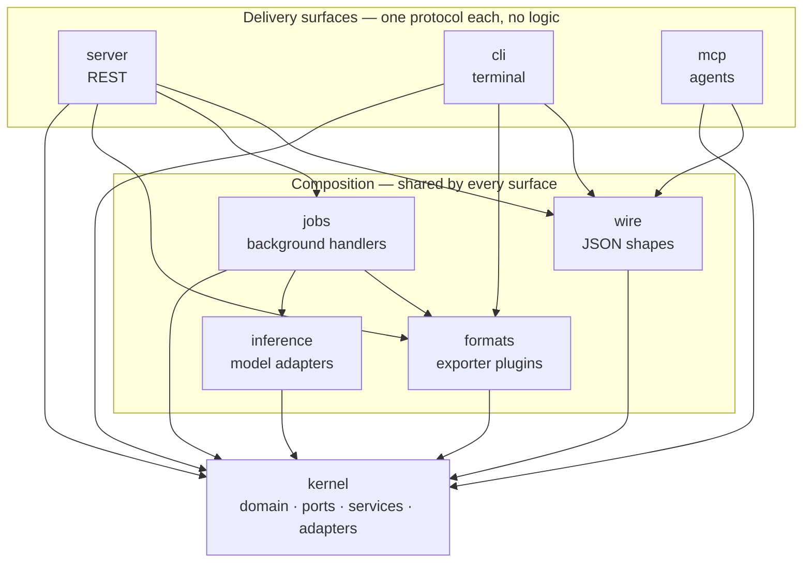

# The backend

One Python distribution, [`src/visionset/`](../../../src/visionset/), holding eight
packages. They are not peers: there is a core that knows the domain, a ring of
packages that turn the domain into something a caller can use, and a ring of
surfaces that speak a protocol.

## The stack

Read the diagram as a dependency graph: an arrow is "may import". Nothing points
upward, and the three surfaces do not point at each other.

## The packages

| Package | What it is | Page |
| --- | --- | --- |
| [`kernel`](../../../src/visionset/kernel/) | The domain, the ports, the services, and the default adapters. Everything else is a client of it. | [kernel.md](kernel.md) |
| [`server`](../../../src/visionset/server/) | FastAPI. Routes, wire models, and the error mapping. | [server.md](server.md) |
| [`cli`](../../../src/visionset/cli/) | Typer. The whole cycle from a shell. | [cli.md](cli.md) |
| [`mcp`](../../../src/visionset/mcp/) | The MCP tool surface, for agents. | [mcp.md](mcp.md) |
| [`formats`](../../../src/visionset/formats/) | Exporter plugins, discovered by entry point. | [formats.md](formats.md) |
| [`wire`](../../../src/visionset/wire/) | The JSON shapes the CLI and MCP publish. | [wire.md](wire.md) |
| [`jobs`](../../../src/visionset/jobs/) | Handlers for work that outlives a request. | [jobs.md](jobs.md) |
| [`inference`](../../../src/visionset/inference/) | Where a model connection becomes a running model. | [inference.md](inference.md) |

## What the rules are, and where they live

Four import-linter contracts in [`pyproject.toml`](../../../pyproject.toml) hold
the graph above. They are run by `uv run lint-imports`, which
[`scripts/check.sh`](../../../scripts/check.sh) invokes.

| Contract | What it forbids |
| --- | --- |
| Kernel purity | `visionset.kernel` importing `server`, `cli`, `mcp`, `formats`, `wire`, `jobs`, `inference`, or `fastapi` / `typer` / `mcp` / `uvicorn` |
| Delivery clients are siblings | `server`, `cli` and `mcp` importing each other |
| Job handlers are below the surfaces | `visionset.jobs` importing any delivery package or web framework |
| Inference adapters are below the surfaces | `visionset.inference` importing any delivery package, or `visionset.jobs` |

The first is the load-bearing one, and it has a second enforcement:
[`tests/architecture/test_kernel_purity.py`](../../../tests/architecture/test_kernel_purity.py)
imports the kernel in a **fresh interpreter** and asserts no forbidden module
appears in `sys.modules`. A static contract can be satisfied by a deferred import
inside a function; a fresh-process check cannot.

If a change fights one of these, the change is wrong — see
[cross-cutting.md](../cross-cutting.md) for why the boundary sits where it does,
and the [`kernel-architecture`](../../../.agents/skills/backend/kernel-architecture/SKILL.md)
skill for how to add a port, an adapter or a plugin without breaking it.
