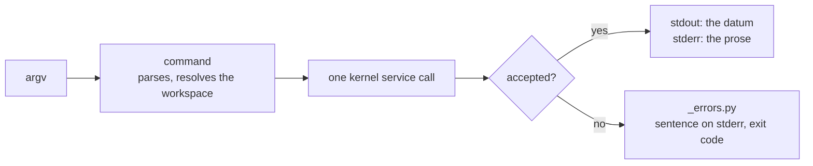

# cli

[`src/visionset/cli/`](../../../src/visionset/cli/) is Typer over the kernel. Its
claim is that the whole cycle — create a project, define a schema, ingest, approve,
annotate, promote, publish, export — is reachable from a shell without touching
Python.

## The shape of a command

Two rules make the output composable, and both are held by tests:

- **stdout is data, stderr is prose.** `BATCH=$(visionset ingest …)` works because
  the id is the only thing on stdout; everything a person reads goes to stderr.
- **`--json` is the API's shape.** The projections come from
  [`visionset.wire`](wire.md), not from a second set of dicts written here, so a
  caller moves between `curl | jq` and `visionset --json | jq` without relearning
  field names.

## Exit codes

Three, and one of them carries two meanings deliberately — `visionset release
verify` and `visionset export --check` both use `1` for *the check ran and the
answer is no*, which is distinct from *the command failed*. Both meanings are
written down in [`_errors.py`](../../../src/visionset/cli/_errors.py).

## What it may depend on

The `Delivery clients are siblings` contract forbids `visionset.cli` importing
`visionset.server` or `visionset.mcp`. Anything two surfaces need is promoted
downward instead — which is the whole reason [`visionset.wire`](wire.md) is its own
package rather than a `cli/_json.py`.

Resolving a format name to an exporter plugin happens *here*, not in the kernel:
`visionset.formats.registry.exporter(name)`, never a dict lookup, because a
`KeyError` is outside the `VisionSetError` tree and would answer a typo with a
traceback.

## Related

[`docs/cli.md`](../../cli.md) is the command reference: the whole cycle as a
script, what `--json` promises, why `--workspace` follows the subcommand, and what
`visionset init` and `visionset server` each do.
