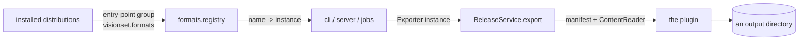

# formats

[`src/visionset/formats/`](../../../src/visionset/formats/) holds the exporters. It
is the one place in the distribution built as a **plugin system**: a format is
discovered at runtime through an entry-point group, so a third-party distribution
can ship one and VisionSet finds it without knowing it exists.

## Discovery

The kernel never resolves a name. `ReleaseService.export` takes an `Exporter`
**instance**, because the `Kernel purity` contract forbids
`visionset.kernel` importing `visionset.formats` - a plugin registry is discovery,
and the kernel is the part that must not do any. So the surface holding the name
does the lookup, always through `registry.exporter(name)` rather than a dict, so a
typo answers a `VisionSetError` rather than a `KeyError` and a traceback.

## What ships

Nine plugins in [`pyproject.toml`](../../../pyproject.toml)'s
`[project.entry-points."visionset.formats"]`:

| Name | Module |
| --- | --- |
| `dummy` | [`_dummy.py`](../../../src/visionset/formats/_dummy.py) - writes nothing; the registry's own test subject |
| `yolo` | [`yolo/`](../../../src/visionset/formats/yolo/) |
| `coco` | [`coco/`](../../../src/visionset/formats/coco/) |
| `voc` | [`voc/`](../../../src/visionset/formats/voc/) |
| `tusimple`, `curvelanes`, `bdd100k-lane`, `culane`, `openlane-2d` | [`lanes/`](../../../src/visionset/formats/lanes/) - five plugins over one shared core |

## What a plugin declares

The `Exporter` port ([`kernel/ports/exporter.py`](../../../src/visionset/kernel/ports/exporter.py))
asks for three capability facts, and the split between them is the interesting
part:

- `lossy` - a blanket statement about everything a capability list cannot see:
  attributes, confidence, provenance. True or false for the format, forever.
- `supported_geometries` - what it writes **intact**.
- `degraded_geometries` - what it writes **having lost something**, such as a
  polygon arriving as its axis-aligned bounding box.

The last two are disjoint, and a geometry in neither is not written at all. Three
states rather than two, because a boolean answers "is this written?" and "is this
written intact?" with one word - and a caller consenting to lose three annotations
would receive two of them back as boxes.

A plugin also gets a `ContentReader` and never a `BlobStore`: a reader can read
where the port could also `put`, and a plugin that could write into the content
store could give a release bytes nobody published.

## The gate that keeps a report honest

[`tests/formats/test_report_agreement.py`](../../../tests/formats/test_report_agreement.py)
reads every count back out of the written artifacts and compares it against what
the compatibility report claimed. A fourth exporter registering into the group
either lands a counter there or is declared as one that writes nothing - a format
cannot be added and quietly skipped.

## Related

[`docs/releases.md`](../../releases.md) covers the artifact being exported.
`ReleaseService`'s own docstring covers the consent gate.
