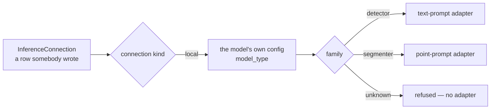

# inference

[`src/visionset/inference/`](../../../src/visionset/inference/) is the composition
root for models: a configuration row in, a running `ModelProvider` out.

## Why it is its own package

Running a model means torch and transformers, and the kernel may import neither —
the port describes a protocol, and the kernel has to stay implementable on a
machine that could not run anything. So the code that turns a row into a running
model cannot live in the kernel. It must not live in a delivery package either:
the CLI, the API and a background worker all need it, and shared logic moves
*down*, never sideways. One package above the kernel and beside `formats`, `wire`
and `jobs` is the only place left.

## Resolution is two steps

**There is no entry-point group**, and that is the decision rather than an
omission. `Importer` and `Exporter` name `visionset.formats` because a format is a
plugin a third party ships. A provider is not that shape: adapters are
instantiated from **user-created connections** and never from a bundled default,
which makes `InferenceConnection` the registry — a row naming a kind, a model and
where it runs. A provider discovered by entry point would have nothing to be
instantiated *from*, and a workspace could acquire the ability to predict through
an unrelated `pip install`, which is precisely what "VisionSet never downloads a
model on its own" exists to prevent.

The connection's kind says *where*; the model's own config says *which family*.
A family this build does not serve is refused rather than guessed at — a fallback
answers in the wrong adapter's vocabulary, which is a confident sentence about a
model the user does not have.

## Importing this package imports nothing heavy

Every reference to torch, transformers, accelerate and huggingface_hub is inside a
function. A base install starts a server, runs a worker and imports this module
with the optional runtime absent, and
[`tests/architecture/test_optional_runtime.py`](../../../tests/architecture/test_optional_runtime.py)
proves it in a fresh interpreter.

The optional dependency group is `local-inference`; `_extra.py` names what it
brings and turns a missing one into a sentence carrying the install command.

## Where it sits

`visionset.inference` may not import `visionset.server`, `visionset.cli`,
`visionset.mcp` or `visionset.jobs`. The last is not tidiness: the download
handler imports *this*, so the reverse would close a cycle — and would put the
optional runtime back on the path a worker takes at spawn.

The port itself is held to a narrower rule by
[`tests/architecture/test_model_provider_port.py`](../../../tests/architecture/test_model_provider_port.py):
`kernel/ports/model_provider.py` may import the kernel's own domain and the
standard library, and nothing else. A signature naming a `Path` says there is a
filesystem in common; one naming a tensor says there is an array library in
common. Neither survives a network, and the port has to be implementable across
one.

## Related

[`docs/inference.md`](../../inference.md) is the surface: the connections, why
nothing is downloaded on your behalf, the two kinds, why the revision is pinned,
and where weights land.
