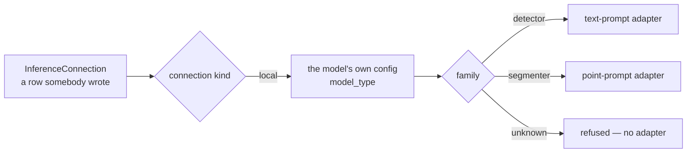

# inference

[`src/visionset/inference/`](../../../src/visionset/inference/) is the composition
root for models: a configuration row in, a running `ModelProvider` out.

## Why it is its own package

Running a model means torch and transformers, and the kernel may import neither -
the port describes a protocol, and the kernel has to stay implementable on a
machine that could not run anything. So the code that turns a row into a running
model cannot live in the kernel. It must not live in a delivery package either:
the CLI, the API and a background worker all need it, and shared logic moves
*down*, never sideways. One package above the kernel and beside `formats`, `wire`
and `jobs` is the only place left.

## Resolution is two steps

**There is no entry-point group**, and that is the decision rather than an
omission. `Importer` and `Exporter` name `visionset.formats` because a format is a
plugin a third party ships. A provider is not that shape: adapters are
instantiated from **user-created connections** and never from a bundled default,
which makes `InferenceConnection` the registry - a row naming a kind, a model and
where it runs. A provider discovered by entry point would have nothing to be
instantiated *from*, and a workspace could acquire the ability to predict through
an unrelated `pip install`, which is precisely what "VisionSet never downloads a
model on its own" exists to prevent.

The connection's kind says *where*; the model's own config says *which family*.
A family this build does not serve is refused rather than guessed at - a fallback
answers in the wrong adapter's vocabulary, which is a confident sentence about a
model the user does not have.

## One fact, two readings, one module

`families.py` holds the family sets **and** the map from a family to what a
connection may be asked for, because they are the same fact read twice: which
adapter can run this model, and which prompts a caller may send it. The map is
*derived* from the sets rather than listed beside them, so an adapter and its
declaration are one edit - a family added to `SEGMENTER_FAMILIES` and forgotten in
a hand-written map would run fine and declare nothing, and every client that
filters on the declaration would stop offering it.

The vocabulary itself is the kernel's (`ModelCapability`) and the mapping is not:
what a tool can ask for is a domain word, while which `model_type` values this
build serves is a fact about an optional runtime that the kernel has no view of.

## The family is recorded, not only resolved

Resolution used to happen on every provider build and be thrown away. A connection
now stores what its config declared, written when the download finishes - the
first moment the answer exists without reaching a network, and the reason nothing
is read at connection *creation*.

**The backfill for older rows is on the read path, and that is a layering fact.**
A migration would be the natural home and cannot be one: migrations run inside the
kernel, and the kernel may not import this package or address the model cache the
answer lives in. So `with_families` fills a row in on the first read of it, from
files already on the disk, once - a row that has an answer is never asked again,
including when the answer is "the config declared nothing". A build without the
optional runtime records nothing rather than recording that it found nothing,
because a build that cannot look has not looked.

## Importing this package imports nothing heavy

Every reference to torch, transformers, accelerate and huggingface_hub is inside a
function. A base install starts a server, runs a worker and imports this module
with the optional runtime absent, and
[`tests/architecture/test_optional_runtime.py`](../../../tests/architecture/test_optional_runtime.py)
proves it in a fresh interpreter.

**That proof needs an environment where the libraries are actually installed.**
On a machine without them, "importing the product left torch out of `sys.modules`"
is true whatever the code does, so the assertion passes and says nothing. CI's
`inference-smoke` job is where it means something: it installs the extra from the
lockfile and runs this file among the rest of the inference surface. The two
halves of that matrix, and the environment variable that keeps the with-runtime
half honest, are described in
[CONTRIBUTING](../../../CONTRIBUTING.md#the-two-halves-of-the-inference-matrix).

The optional **extra** is `local-inference` - an extra rather than a dependency
group, because a group is for developing this repository and this is something a
user installs. `_extra.py` names what it brings and turns a missing one into a
sentence carrying the install command.

## Where it sits

`visionset.inference` may not import `visionset.server`, `visionset.cli`,
`visionset.mcp` or `visionset.jobs`. The last is not tidiness: the download
handler imports *this*, so the reverse would close a cycle - and would put the
optional runtime back on the path a worker takes at spawn.

The port itself is held to a narrower rule by
[`tests/architecture/test_model_provider_port.py`](../../../tests/architecture/test_model_provider_port.py):
`kernel/ports/model_provider.py` may import the kernel's own domain and the
standard library, and nothing else. A signature naming a `Path` says there is a
filesystem in common; one naming a tensor says there is an array library in
common. Neither survives a network, and the port has to be implementable across
one.

## Adding a family, and the candidates worth adding

Most additions are cheap, and knowing which kind of cheap comes first. A family
this build already resolves costs a curated catalog entry and nothing else. A new
family in the same capability costs a `model_type` string in one of the sets in
`families.py` plus a check that its post-processing signature matches what the
existing adapter does. Only a genuinely new capability costs a family *and* an
adapter - and because the capability map is derived from the sets rather than
listed beside them, a family added to a set acquires its declared capability in
the same edit.

What follows is the standing list of what could be added next, so that each
addition starts here instead of from scratch. Every `model_type` quoted is what a
checkpoint's own `config.json` declares rather than what its name suggests, and
every license below was read on **2026-08-10**. A candidate that moves out of this
list into the build takes its row with it, into the shipped table.

### Four rules for curating one

**A license is verified per checkpoint, never per family.** Read the LICENSE of
the checkpoint being curated, and record the license, the revision and the date it
was verified beside it. Checkpoints inside one family disagree -
`OpenGVLab/InternVL3-8B` declares `apache-2.0` while `OpenGVLab/InternVL3-78B`
declares `other`, so a family-level verdict would have been wrong for one of them
whichever way it was written. Second-hand summaries disagree with the repositories
as well: a survey in circulation classifies SAM 2 as custom-licensed, where the
repository ships plain Apache-2.0.

**Weights come from the original publishers, through `transformers`.**
Third-party inference and labeling-ecosystem frameworks are not taken as runtime
dependencies; external work in that space is design reference only. A candidate
that exists solely inside one is excluded on that ground alone.

**Copyleft, business-source and custom-gated licenses are never bundled and never
curated as defaults.** At most they are reachable through the **Custom model...**
path a user types themselves, at that user's own compliance risk.

**`transformers`-native is strongly preferred**, because it is one integration
surface. A candidate published only as a raw `.pt` or `.onnx` checkpoint needs its
own loader and its own adapter, which is a different order of cost from a set
entry however small the model is.

Curated entries live in
[`inferenceCatalog.ts`](../../../frontend/ui-core/src/screens/inferenceCatalog.ts),
which records a model id, a pinned revision and a download size per entry and
asserts the license once, in the module's prose, for the whole list. Pinning the
license per entry the way the revision is pinned is what would make a family-level
assumption impossible to write by accident.

### What ships today

| Family (`model_type`) | Capability | Curated checkpoints | License |
| --- | --- | --- | --- |
| `sam2`, `sam2_video` | `point_suggest` | `facebook/sam2.1-hiera-{tiny,small,base-plus,large}` | Apache-2.0 |
| `grounding-dino` | `text_detect` | `IDEA-Research/grounding-dino-{tiny,base}` | Apache-2.0 |
| `mm-grounding-dino` | `text_detect` | none | - |

`mm-grounding-dino` is in `DETECTOR_FAMILIES` and therefore already resolves; what
it lacks is a curated entry. Resolvable versus curated is the first distinction to
check about any candidate below.

### `text_detect` - already resolvable, only uncurated

Both of these declare `model_type: mm-grounding-dino` and the
`MMGroundingDinoForObjectDetection` architecture, so they land in the shipped
family set with no resolver change at all. Both need their post-processing
signature confirmed against the locked `transformers` before curation, which is
the thing `DETECTOR_FAMILIES` is narrow about.

| Candidate | Publisher | License | Cost |
| --- | --- | --- | --- |
| `openmmlab-community/mm_grounding_dino_tiny_o365v1_goldg_v3det` | OpenMMLab | `apache-2.0` | catalog entry only |
| `iSEE-Laboratory/llmdet_base` | iSEE Laboratory | `apache-2.0` | catalog entry only |

MM-Grounding-DINO is the strongest candidate for the teacher model in unattended
batch pre-labeling: the same interface, better reported accuracy than the base
family, and a tiny rung that stays plausible on a CPU. LLMDet reusing the same
architecture is the trap worth remembering - it reads as a separate family by name
and is not one by config.

### `text_detect` - new family, real integration

| Candidate | `model_type` | Publisher | License | Cost |
| --- | --- | --- | --- | --- |
| `omlab/omdet-turbo-swin-tiny-hf` | `omdet-turbo` | OmLab | `apache-2.0` tag; read the LICENSE file before curating | family entry + post-processing check |
| `google/owlv2-base-patch16-ensemble` | `owlv2` | Google | `apache-2.0` | family entry + post-processing check |

Both take a different post-processor from the Grounding DINO family - no
`input_ids`, no `text_threshold` - which is exactly the failure the narrow family
set exists to prevent, so neither is a one-line addition however similar the
interface looks. OWLv2 additionally accepts image-guided queries, which is the
nearest existing thing to exemplar-guided labeling.

### `point_suggest` - lightweight alternatives

| Candidate | Publisher | License | `transformers` | Cost |
| --- | --- | --- | --- | --- |
| `dhkim2810/MobileSAM` | the author's repository | `mit`, not Apache-2.0 | no - the repository holds `mobile_sam.pt` alone | own loader + adapter |
| `yunyangx/EfficientSAM` | the author's repository | `apache-2.0` | no - `.pt` / `.onnx` only | own loader + adapter |

Neither is `transformers`-native, so both cost far more than "small model, small
change" suggests. Curate only if one is measured to beat `sam2.1-hiera-tiny` on a
CPU, since that rung already exists and already works.

### A new capability: `embed`

Exemplar filtering for batch pre-labeling is the use that would justify it. No
capability is designed for either candidate today, so both cost a family and an
adapter on top of the vocabulary itself.

| Candidate | `model_type` | Publisher | License |
| --- | --- | --- | --- |
| `google/siglip2-base-patch16-224` | `siglip` | Google | `apache-2.0` |
| `facebook/dinov2-base` | `dinov2` | Meta | `apache-2.0` |

The SigLIP 2 checkpoints declare `model_type: siglip` - the generation is in the
name and not in the config, which is the same trap the per-checkpoint rule exists
for.

### Multi-task VLM assist - exploratory

Nothing here maps onto a capability this build has. Listed so that the licenses
are on record if one is ever designed for them.

| Candidate | Publisher | License |
| --- | --- | --- |
| `microsoft/Florence-2-base` | Microsoft | `mit` |
| `Qwen/Qwen3-VL-8B-Instruct` | Alibaba | `apache-2.0` |
| `OpenGVLab/InternVL3-8B` | OpenGVLab | `apache-2.0`, where `InternVL3-78B` is `other` |

### Video

`sam2_video` is already resident: the published SAM 2.1 checkpoints declare it and
`SEGMENTER_FAMILIES` names it. Beyond that, tracker families such as ByteTrack
(MIT) pair with any detector rather than replacing one, so they are a pipeline
question and not a family entry.

### The gate a gated model hits

`facebook/sam3` is a capability step-change - concept segmentation from text or
exemplar prompts - and it is **gated**: the hub reports `gated: manual` and a
`license: other`, and its `config.json` cannot be read without accepting terms.

Two separate blockers, and only the second is this build's. The license is not one
the third rule above permits bundling or curating. And the download job has no
notion of an authenticated fetch - no hub token, no terms acceptance - so a gated
revision is unreachable regardless of its license. That is the gate any future
gated candidate would hit, recorded here rather than as current debt.

## Related

[`docs/inference.md`](../../inference.md) is the surface: the connections, why
nothing is downloaded on your behalf, the two kinds, why the revision is pinned,
and where weights land.
