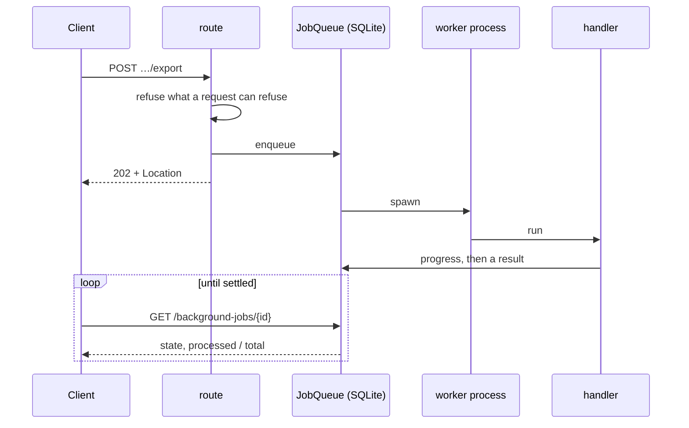

# jobs

[`src/visionset/jobs/`](../../../src/visionset/jobs/) holds the handlers for work
that outlives the request that asked for it: an ingest run, an export, a weights
download, an integrity check.

## Launch and poll

Two properties of that shape are decisions rather than mechanics.

**A refusal a request can make is a refusal the request makes.** The export route
checks the consent gate synchronously, before the job row exists, so a 409 arrives
as the answer to the request that asked rather than as a failed row somebody has
to go and read. The worker checks again — *that* one is the guarantee.

**There is no generic launch route.** Nothing creates a job by naming a type and a
payload: an export is launched from `POST /releases/{id}/export`, an ingest from
`POST /sources/{id}/ingest-jobs`. A generic endpoint would be a remote-code
surface with a token in front of it, and the payloads are internal contracts that
would become public the day one shipped.

## Where it sits

`visionset.jobs` may not import `visionset.server`, `visionset.cli`,
`visionset.mcp`, `fastapi`, `typer` or `uvicorn` — the `Job handlers are below the
surfaces` contract.

The reason is sharper than layering. A handler runs in a worker the dispatcher
started with `spawn`, so the child imports whatever the handler names. If it named
`visionset.server`, the child would re-execute that module's `app = create_app()`
and build a **second application** — with its own workspace handle and its own
dispatcher — inside a worker.

The kernel, in turn, may not import `visionset.jobs`: a handler resolves a format
plugin, so `jobs` imports `formats`, and a kernel that could reach a handler could
reach a plugin through it. It is also what keeps `SqliteJobQueue` unable to resolve
a job type, which is why `UnknownJobType` is raised outside the kernel.

## Related

[`docs/background-jobs.md`](../../background-jobs.md) is the executor itself: the
`JobQueue` port, the SQLite queue, the dispatcher, and the handler contract. It is
a different thing from [`docs/jobs.md`](../../jobs.md), which is *human* annotation
work.
