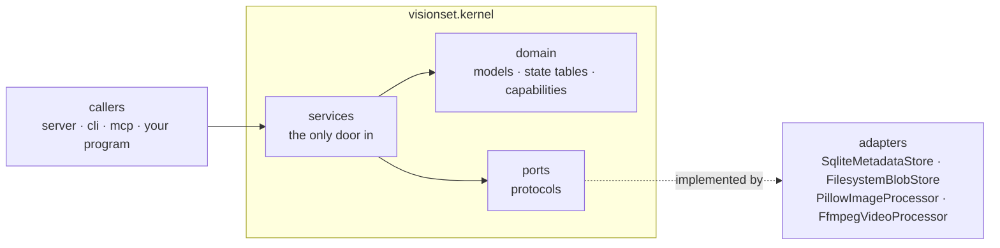

# kernel

[`src/visionset/kernel/`](../../../src/visionset/kernel/) is the part of VisionSet
that knows what a project, a batch and a release *are*. Everything else in the
repository is a way of reaching it.

It is a hexagon: the domain in the middle, ports on the edge, adapters outside
them, and services as the only door in.

## Ports and adapters

`ports` declares protocols and nothing else — a `MetadataStore`, a `BlobStore`, an
`ImageProcessor`, a `VideoProcessor`, an `EventBus`, a `JobQueue`, an
`AuthProvider`, a `ProgressReporter`, an `Exporter`, an `Importer`, a
`ModelProvider`. `adapters` holds the implementations this distribution ships.
A service names a port, never an adapter, which is what lets a test drive a
service against an object literal.

## The four directories

| Directory | Holds | Rule |
| --- | --- | --- |
| [`domain/`](../../../src/visionset/kernel/domain/) | pydantic models, the transition tables, the capability tables | Pure values. Imports nothing from the rest of the kernel. |
| [`ports/`](../../../src/visionset/kernel/ports/) | `Protocol` declarations | Signatures name domain types and standard-library types. Nothing else. |
| [`services/`](../../../src/visionset/kernel/services/) | the twelve services | The only way to change anything. Take an open `WorkspaceService` and reach ports through it. |
| [`adapters/`](../../../src/visionset/kernel/adapters/) | SQLite, the filesystem, Pillow, ffmpeg | The only place a third-party library is named. |

## The purity contract

The kernel may not import `visionset.server`, `visionset.cli`, `visionset.mcp`,
`visionset.formats`, `visionset.wire`, `visionset.jobs` or `visionset.inference`,
nor `fastapi`, `typer`, `mcp` or `uvicorn`.

The obvious half is that a domain must not depend on a delivery mechanism. The
less obvious half is why `formats`, `wire`, `jobs` and `inference` are on the list
when none of them is a web framework: each is a place where a *decision about the
outside world* is made — which plugin exists, what gets published, what runs in a
worker, which model is loaded — and a kernel that could reach one could reach the
thing behind it. `ReleaseService.export` takes an `Exporter` **instance** for
exactly this reason: resolving a format name to a plugin is discovery at runtime,
and the kernel is the part that must not do any.

Enforced twice, and the second one is the one that catches a lazy import:

- [`pyproject.toml`](../../../pyproject.toml) — the `Kernel purity` import-linter
  contract, run by `uv run lint-imports`.
- [`tests/architecture/test_kernel_purity.py`](../../../tests/architecture/test_kernel_purity.py)
  — imports the kernel in a fresh interpreter and inspects `sys.modules`.

The kernel is also the one package `mypy` runs in strict mode over:
`uv run mypy src/visionset/kernel`.

## Where the behaviour is written down

This page is about arrangement. What the services actually do has its own pages:
[workspaces](../../workspaces.md), [projects](../../projects.md),
[schemas](../../schemas.md), [sources](../../sources.md), [ingest](../../ingest.md),
[batches](../../batches.md), [jobs](../../jobs.md),
[annotations](../../annotations.md), [datasets](../../datasets.md),
[releases](../../releases.md), [events](../../events.md),
[persistence](../../persistence.md) and [media](../../media.md).

The [`kernel-architecture`](../../../.agents/skills/backend/kernel-architecture/SKILL.md)
skill is the one to read before adding a module here.
