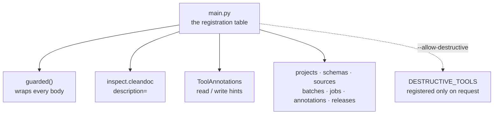

# mcp

[`src/visionset/mcp/`](../../../src/visionset/mcp/) is the surface an agent uses.
It speaks MCP over stdio, and it is the fourth client of the same kernel — every
tool is a thin mapping onto one or two service calls.

## Registration is a table



Registration happens in one table in
[`main.py`](../../../src/visionset/mcp/main.py) rather than as a decorator at each
definition site. That is not style: `@server.tool()` inside `projects.py` would
make that module import `main`, which imports it. Doing it in one place also gives
the three cross-cutting decisions exactly one home — the error wrapper, the
cleaned docstring that becomes the tool description, and the read/write
annotations — and lets
[`tests/mcp/test_registration.py`](../../../tests/mcp/test_registration.py) assert
that every registered tool went through all three.

## The destructive posture

Tools that destroy something are **not registered** unless the server was started
with `--allow-destructive`. The reason is measured rather than theoretical: when
the caller is a model, a `confirm=True` parameter is documented in the same
listing the caller reads before choosing, so the description that explains the
gate is also the instruction for clearing it. Moving the gate to the server's own
startup puts it somewhere the agent cannot reach.

`confirm` itself is untouched and stays correct for every other surface.

## The error envelope

An agent both reads and decides, so it gets the kernel's own sentence **and** one
machine-readable field:

```json
{"error": {"message": "…", "retry_with": "allow_destructive", "hint": null, "index": null}}
```

There is deliberately no `code`. The codes live in `server/errors.py`, which this
package may not import — the `Delivery clients are siblings` contract — and
deriving one from a class name would key a public contract to a Python identifier.
What a code was actually needed for here is one question, *may I retry this, and
with what?*, and `RETRY_WITH` in
[`_errors.py`](../../../src/visionset/mcp/_errors.py) answers it directly.

## Two generated artifacts

- [`docs/mcp-tools.md`](../../mcp-tools.md) is written from the tool listing the
  server actually advertises, by `scripts/export_mcp_tools.py`. A hand-written
  reference would be a second copy of an interface an agent reads verbatim.
- [`tests/architecture/test_capability_reachability.py`](../../../tests/architecture/test_capability_reachability.py)
  resolves every declared batch action against the real routing table *and* the
  real tool listing, so a capability the wire declares cannot be unperformable.

## Related

[`docs/mcp.md`](../../mcp.md) is the surface itself — every tool and what it is
for, the coordinate-frame rule, the three gate words, and the stated limits.
[`docs/mcp-walkthrough.md`](../../mcp-walkthrough.md) is a session start to finish.
