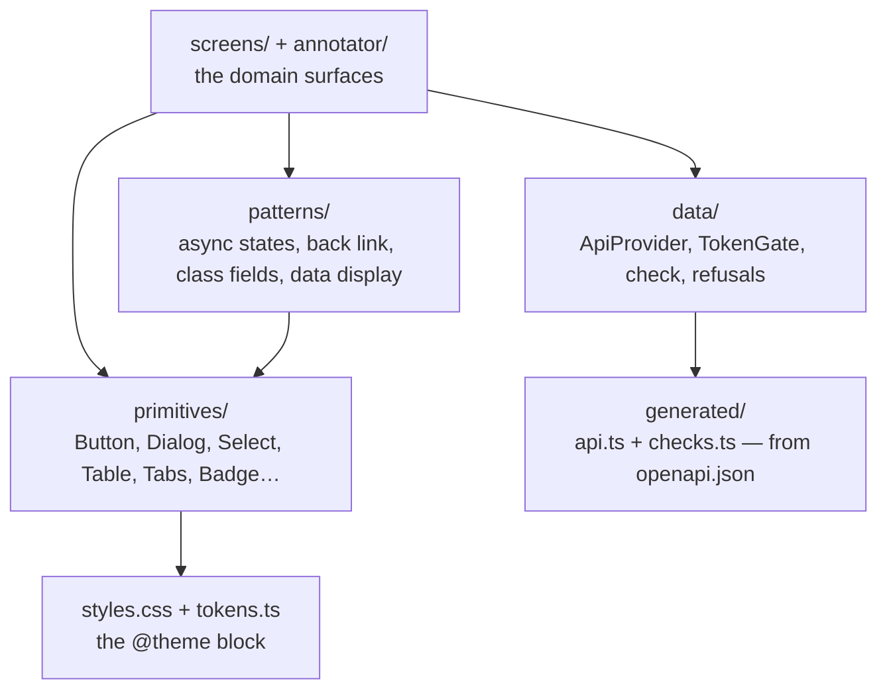
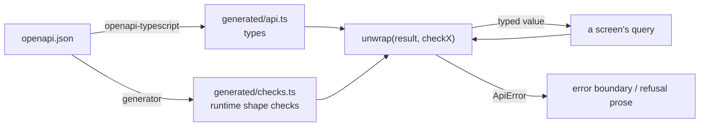

# @visionset/ui-core

[`frontend/ui-core/`](../../../frontend/ui-core/) is where the product's UI
actually lives: the design system, the domain screens, and the typed client that
talks to the API. Everything except routing.

## The layers inside it

## Navigation arrives as a callback

This package imports **no router**. A screen that reached for `useNavigate` would
only work inside a `react-router` tree, which is a dependency the future
enterprise UI has no reason to share. So every destination is a prop -
`onOpenProject`, `onOpenGallery`, `onBack` - and [the app](app.md) turns each into
a URL.

The same rule runs the other way and is worth stating because it decides a lot of
small questions: a host that cannot honour a control **passes no callback and gets
no control**, rather than a dead one.

## No module below `ApiProvider` calls `fetch`

One client, one query cache, one answer to a 401. `data/ApiProvider.tsx` holds
where the API is, which credential is in use, and what happens when that
credential stops working; screens get the typed client through a hook.

The 401 is handled once, in a cache subscription, because a token revoked while an
annotator has a job open produces a 401 from whichever background refetch happens
to fire next - and a per-screen `if (error.status === 401)` would leave that
screen showing an error and every other screen showing stale data forever.

## The generated client, and the check beside it

`src/generated/` is written from the committed [`openapi.json`](../../../openapi.json)
and is never hand-edited. `openapi-fetch` types a response off the contract and
verifies **nothing** at runtime, so `unwrap` takes a generated *check* as well:

Without the check, a well-formed JSON document of the wrong type reaches a screen
intact and one `undefined` in a formatter takes the page down. The check is
required rather than optional because an optional gate is one every new call site
may forget - and the ones that forgot would be the ones that broke. That the
*right* check is paired with each call is held by
`tests/scripts/checks_wiring.test.mjs`, because a type predicate is assignable
whenever its asserted type is and `tsc` cannot see the mismatch.

## The design system is the stylesheet

`styles.css` carries the Tailwind v4 `@theme` block, so `bg-primary` in a
component here and `bg-primary` in a screen mean the same colour by construction.
There is no `tailwind.config.js` in this repository and there must not be one -
the tokens would acquire a second home.

`tests/scripts/design_tokens.test.mjs` scans every tracked frontend file for a hex
or a `var()` colour in a class string and fails the build on one.

## Libraries

The primitive and utility stack is an architecture decision recorded here, not a
visual-design rule. The current choices:

| Concern | Choice |
| --- | --- |
| UI primitives | Radix (+ shadcn-style composition with `cva` and `cn`) |
| Icons | lucide-react |
| Styling | Tailwind v4, CSS-first `@theme` - no `tailwind.config.js`, ever |
| Toasts | sonner |
| Component tests | vitest + jsdom + @testing-library/react |
| Server state | TanStack Query v5 |

Do not add a library for a covered concern without a documented reason. The intended
direction - documented, not yet implemented - is to adopt shadcn-derived, project-owned
primitives in this package while preserving its public APIs, implementing the
foundations [`DESIGN.md`](../../../DESIGN.md) documents.

## Related

[`DESIGN.md`](../../../DESIGN.md) is the contract this package implements.
[`docs/ui.md`](../../ui.md) covers the data shell. The
[`ui-capabilities`](../../../.agents/skills/frontend/ui-capabilities/SKILL.md)
skill governs any state-gated control, and
[`information-architecture`](../../../.agents/skills/frontend/information-architecture/SKILL.md)
is the sitemap.
