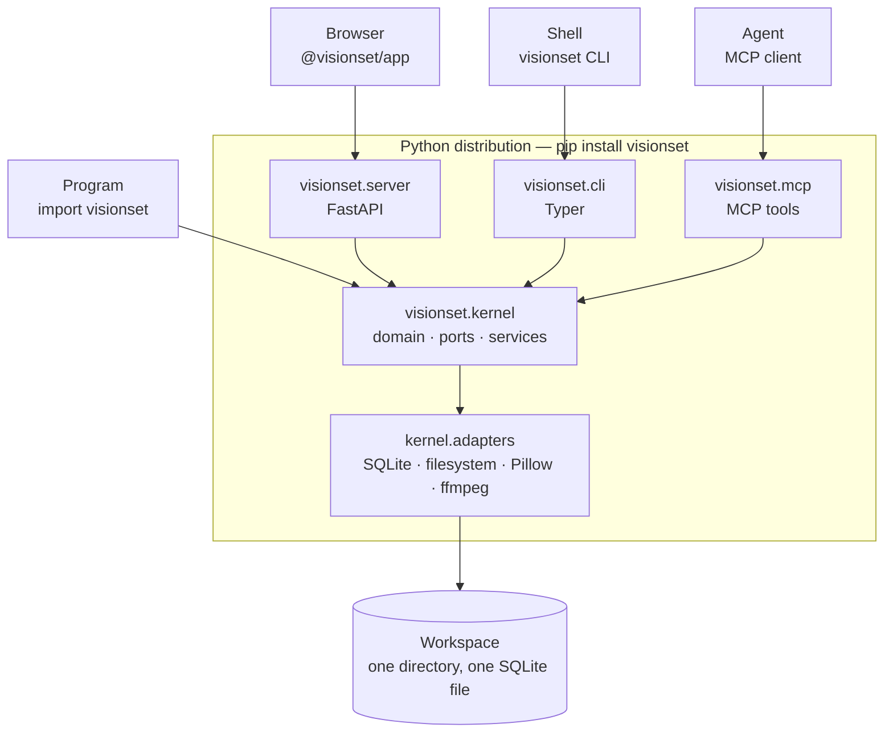

# Architecture

VisionSet is an SDK with clients attached. One Python package defines what a
dataset *is*. Every user-facing or programmatic surface - the REST API, CLI, MCP
server, and browser - is a thin translation layer over that package. This section
follows the same order: start here, then continue into the area you plan to change.

These pages describe the system's *shape*: what each layer is, what it may depend
on, and where those rules are enforced. They do not restate behavior. Where a topic has an
authoritative page under [`docs/content/`](../README.md) or a skill under
`.agents/skills/`, this tree links to the authoritative source instead of
duplicating it and risking drift.

## The system

Every arrow points one way. The kernel never imports a surface, and the surfaces
never import each other - both are checked by import-linter contracts in
[`pyproject.toml`](../../../pyproject.toml) and by a fresh-process test in
[`tests/architecture/`](../../../tests/architecture/).

## The two halves

| Half | Lives in | Ships as | Page |
| --- | --- | --- | --- |
| Python distribution | [`src/visionset/`](../../../src/visionset/) | a `pip` wheel | [backend/](backend/README.md) |
| Frontend workspace | [`frontend/`](../../../frontend/) | npm packages, and a bundle inside the wheel | [frontend/](frontend/README.md) |

The browser is not a separate product. `visionset server` serves the compiled
bundle from `src/visionset/_static/` under `/app`, so one `pip install` is the
whole thing.

## Where to go next

- [backend/](backend/README.md) - the layer stack, and a page per package.
- [frontend/](frontend/README.md) - the three workspace packages and how they
  depend on each other.
- [cross-cutting.md](cross-cutting.md) - the two machine-enforced boundaries, the
  capabilities contract, and the batch lifecycle at a glance.

For what the system *does* rather than how it is arranged, the index at
[`docs/content/README.md`](../README.md) is the map. [`DESIGN.md`](../../../DESIGN.md) is the
visual contract, and [`CONTRIBUTING.md`](../../../CONTRIBUTING.md) lists the checks.
