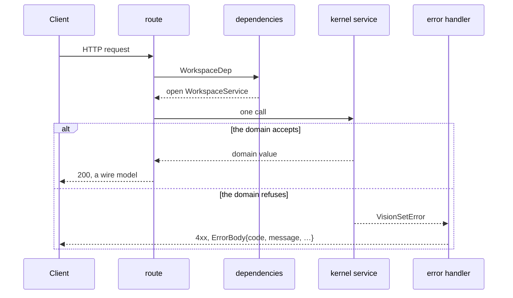

# server

[`src/visionset/server/`](../../../../src/visionset/server/) is FastAPI over the
kernel. A handler resolves a workspace, calls one or two services, and shapes the
answer. It decides no domain rule, and it interprets no error.

## A request



The refusal path is the point. A route never catches a domain error and never
translates one: it raises, and the handlers `create_app()` installed turn every
`VisionSetError` into an `ErrorBody` with a stable `code`. The mapping is one
table, `ERROR_RULES` in
[`errors.py`](../../../../src/visionset/server/errors.py), so a code cannot be
invented at a call site.

## What is in the package

| Module | Holds |
| --- | --- |
| [`main.py`](../../../../src/visionset/server/main.py) | `create_app()`, the static bundle mount, the SPA deep-link fallback |
| [`routes/`](../../../../src/visionset/server/routes/) | one module per resource - projects, schemas, sources, ingest, batches, jobs, annotations, assets, datasets, releases, formats, background jobs, inference |
| [`models.py`](../../../../src/visionset/server/models.py) | the pydantic request and response models `openapi.json` is generated from |
| [`errors.py`](../../../../src/visionset/server/errors.py) | `ERROR_RULES` - every domain error's status and code |
| [`dependencies.py`](../../../../src/visionset/server/dependencies.py) | which workspace a request serves, and the bearer-token gate |
| [`session.py`](../../../../src/visionset/server/session.py) | the cookie the server issues to the page it served |
| [`settings.py`](../../../../src/visionset/server/settings.py) | the executor's three environment variables, and the only `pydantic-settings` object in the repository |
| [`uploads.py`](../../../../src/visionset/server/uploads.py) | staging multipart bytes under a digest of the part set, so a path exists for `SourceService` to register |

## `openapi.json` is a committed artifact

[`openapi.json`](../../../../openapi.json) at the repository root is generated from
these models and **committed**. It is the contract two things are built from: the
TypeScript client in `frontend/ui-core/src/generated/`, and any third-party
program. Regenerate it with

```
uv run python scripts/export_openapi.py
```

and commit the diff. A CI drift gate fails when the file and the application
disagree, which is what makes a wire change a reviewable event rather than
something a client discovers.

Handlers are `def` rather than `async def` throughout: every kernel call
underneath is a blocking SQLite call, and a coroutine would run it on the event
loop.

## Related

[`docs/content/api.md`](../../api.md) is the REST surface itself - the conventions, the
error body, what decides 404 / 409 / 422, and which codes are worth retrying.
[`docs/content/auth.md`](../../auth.md) covers tokens and the one identical 401.
