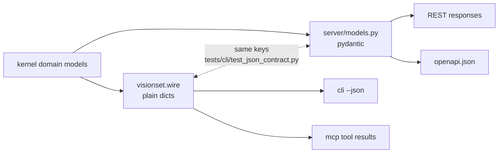

# wire

[`src/visionset/wire/`](../../../../src/visionset/wire/) is one hand-written JSON
projection per resource. It is what `visionset --json` prints and what an MCP tool
result carries.

## Two spellings, not three

The server keeps its own pydantic models because `openapi.json` is generated from
them and a dict cannot do that. So there are two spellings of each shape - and
**two, never three**: this package exists because the CLI and MCP both needed the
same twenty projections, and a second hand-written copy is what "promoted, not
copied" exists to prevent.

The two are held to each other by
[`tests/cli/test_json_contract.py`](../../../../tests/cli/test_json_contract.py),
which imports both and asserts each pair has the same keys *and* that the
projection round-trips through the wire model. A test may import what neither
package may.

## A field reaches a caller because somebody wrote it here

Nothing calls `model_dump()` on a domain model. That would publish whatever the
domain happens to hold today and silently republish whatever it holds tomorrow.
Three fields make the case, and each is deliberately absent from what ships:

- `Asset.uri` and `Source.path` are absolute paths on the machine running the
  server. A caller reading one learns the layout of somebody's disk.
- `Batch.asset_ids` is a batch's whole roll call, which for fifty thousand frames
  must not travel on every read of its name.

Leaf encoding is explicit throughout: UUIDs as strings, enums as `.value`, paths
as strings, timestamps in pydantic's format so the parity gate compares like with
like.

Almost everything a projection reads is a domain model. The one exception is
`capabilities_of` from `visionset.inference`, and it is here rather than spelled
out because which model families this installation serves is a fact this package
has no way to know - a second copy of that map would be exactly the drift every
other rule in this file prevents. The direction is the usual one: a sibling below
the surfaces, importing nothing from here.

## Where it sits

The `Kernel purity` contract forbids `visionset.kernel` importing
`visionset.wire`. It is not a delivery mechanism, but it is the same direction:
it is written in terms of domain models, so a kernel that could import it would
close a loop and make a publication decision reachable from the place that decides
what exists.

Import-linter's independence contract keeps the three surfaces siblings, so
`wire` cannot import `server/models.py` either - which is why the agreement is a
test rather than a shared type.

## Related

[`docs/cli.md`](../../cli.md) documents what `--json` promises.
[`docs/api.md`](../../api.md) documents the REST spelling of the same shapes.
