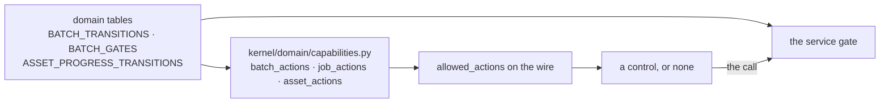
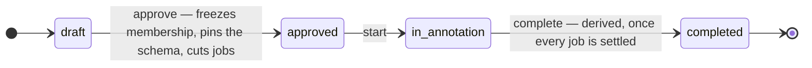
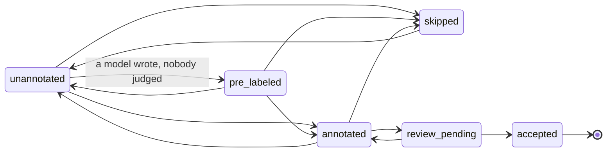

# Cross-cutting

Three things run through every layer. Each has an authoritative home elsewhere;
this page says what they are and points at it.

## The two machine-enforced boundaries

Everything else in this repository is a convention. These two are checked, and a
change that fights one is wrong - the boundary does not move to make a build pass.

### Kernel purity

`visionset.kernel` never imports `visionset.server`, `visionset.cli`,
`visionset.mcp`, `visionset.formats`, `visionset.wire`, `visionset.jobs`,
`visionset.inference` or `visionset.preprocessing`, nor `fastapi`, `typer`, `mcp` or
`uvicorn`.

- **Contract** - `[[tool.importlinter.contracts]]` in
  [`pyproject.toml`](../../../pyproject.toml), run by `uv run lint-imports`.
- **Second check** -
  [`tests/architecture/test_kernel_purity.py`](../../../tests/architecture/test_kernel_purity.py)
  imports the kernel in a fresh interpreter and inspects `sys.modules`, which is
  what a deferred import inside a function cannot satisfy.
- **Why it is drawn there** - [backend/kernel.md](backend/kernel.md).

### The headless annotator

`frontend/annotator/src/core/` never imports React and never reaches the DOM.

- **Three gates**, all run by `pnpm --filter @visionset/annotator lint`: ESLint
  `no-restricted-imports` and `no-restricted-globals` scoped to `src/core/`, plus
  `tsconfig.core.json` - a `noEmit` pass compiling the shipped engine with no DOM
  `lib` and no ambient `@types`, and the only one of the three that can see a DOM
  type in a *signature*.
- **Second check** -
  [`tests/scripts/annotator_boundary.test.mjs`](../../../tests/scripts/annotator_boundary.test.mjs)
  proves each gate fires by breaking it.
- **Why it is drawn there** - [frontend/annotator.md](frontend/annotator.md).

## The capabilities contract

The kernel answers *what may be asked of this resource, right now*, and every
surface publishes that answer as `allowed_actions`. A client renders what the wire
declares and computes nothing.

Both arrows into `Service` read the *same* tables, which is the whole point: a
declaration and a refusal cannot disagree, because neither is a second encoding of
the rule.

Two consequences follow, and both are load-bearing:

- **A client may not mirror a state table.** A hand-written `canSkip` reproduces
  one dimension and drops another, and the dropped dimension is invisible until a
  user meets it.
- **A declared action obliges every client to offer it.** So a name lands on the
  wire only in the same change as the route, the tool and the control that honour
  it. [`tests/architecture/test_capability_reachability.py`](../../../tests/architecture/test_capability_reachability.py)
  resolves every declared batch action against the real routing table and the real
  MCP listing.

The authority is
[`kernel/domain/capabilities.py`](../../../src/visionset/kernel/domain/capabilities.py).
The `ui-capabilities` skill states what a client must do with it — the antipatterns this
contract exists to remove, and how a refusal has to surface.

## The batch lifecycle, at a glance

Three state machines, and they do not cascade - each is derived separately.

An asset inside one has its own six states:

`pre_labeled` is where an unattended model write lands, and it is deliberately writable but
**not promotable**: labels no person has judged must not reach the trunk when the batch
completes. [`annotations.md`](../annotations.md) has the edge table and which door writes each.

And a job runs `pending → in_progress → completed`.

The trap worth knowing before touching any of it: **a job completing does not
complete its batch.** `BatchService` derives that separately, so the ordinary
state of a finished job is *inside an open batch* - which is why writes are gated
on the job as well as on the batch, and why `asset_actions` reads all three
dimensions.

There is no route back from `completed`, at any level. Correcting finished work is
a new batch, not a reopened one.

The model is **settled**, and not re-litigated in an implementation task.
[`docs/content/batches.md`](../batches.md) and [`docs/content/jobs.md`](../jobs.md) are the
behavioural pages; [`annotations.md`](../annotations.md) covers what a write may do to an
asset's progress, and [`datasets.md`](../datasets.md) what leaves a completed batch. The
`dataset-lifecycle-safety` skill carries the short list of invariants an agent has to hold
in mind while touching any of it.
