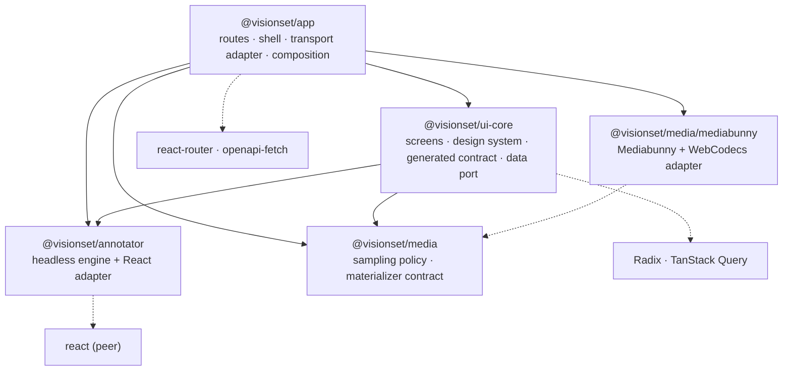

# The frontend

[`frontend/`](../../../../frontend/) is a pnpm workspace containing four packages.
The division is architectural, not merely a build convenience: each package is
defined by what it is *allowed to know*.

## The four packages



Arrows are `dependencies` in each `package.json`. The interesting part is what is
**absent** from each one:

| Package | Depends on | Never |
| --- | --- | --- |
| [`annotator`](annotator.md) | nothing at runtime; `react` is an optional peer | HTTP, a design system, a router |
| [`media`](media.md) | nothing at runtime (core); its own `./mediabunny` subpath depends on `mediabunny` and the browser | React, HTTP, routing, a host — and the core entrypoint never touches `window`, `Worker` or `VideoDecoder` at module scope |
| [`ui-core`](ui-core.md) | `@visionset/annotator`, `@visionset/media` **root entrypoint only**, Radix, TanStack Query; `openapi-fetch` is a dependency for consumer-resolvable type references in emitted declarations, never a runtime/value import | a router, HTTP, `@visionset/media/mediabunny`, or which transport a `FrameSink` uses |
| [`app`](app.md) | all three of the above (`media`'s root **and** its `/mediabunny` subpath), `react-router`, `openapi-fetch` as an actual client | domain logic |

Read down the right-hand column and the architecture falls out. The annotator
ships with **zero runtime dependencies**, so an application can embed it without
inheriting a stack. `media`'s core is the same shape one layer over: a materializer
*contract* with no decoder in it, so importing it never pulls in the ~800 KB
Mediabunny bundle — only the app, which actually needs to decode a video, imports
`@visionset/media/mediabunny`. `ui-core` imports no router and no concrete
materializer, so a screen takes navigation as a callback and video import as an
injected runtime, and both work inside anybody's tree. The app is shell only, so a
capability that lands there instead of in `ui-core` or `media` is an architecture
bug by definition - the future enterprise UI could not reuse it.

## What the workspace runs

```
pnpm -r build     # tsc, and vite for the app
pnpm -r test      # vitest
pnpm -r lint      # eslint, plus the annotator's two typecheck passes
```

None of the four opens a browser by default: both Playwright suites - the annotator
e2e and the real-server cycle - sit outside them, so anything only chromium can see
passes here. `@visionset/media`'s own `test:browser` is the exception, because a
Mediabunny/WebCodecs adapter cannot be proven any other way; it runs real Chromium
against the built package, the same way a consumer would load it. CI runs all of
these on every pull request; `bash scripts/check.sh` runs them all locally, browser
suites included.

The bundle the app produces is copied into `src/visionset/_static/` and served by
`visionset server` under `/app`, which is why one `pip install` is the whole
product.

## Where to go next

- [annotator.md](annotator.md) - the headless engine and the boundary that keeps
  it headless.
- [media.md](media.md) - browser video import: the sampling policy, the
  core/adapter split, and the worker's back-pressure.
- [ui-core.md](ui-core.md) - screens, the design system, and the generated contract.
- [app.md](app.md) - the router shell.

[`DESIGN.md`](../../../../DESIGN.md) is the visual contract and the file to read
before building any screen; the product's own UI rules are
[`docs/content/ui/product-principles.md`](../../ui/product-principles.md),
[`docs/content/ui/navigation.md`](../../ui/navigation.md) and
[`docs/content/ui/annotator.md`](../../ui/annotator.md). [`docs/content/ui.md`](../../ui.md) covers
how the browser client talks to the API. [`docs/content/annotations.md`](../../annotations.md)
covers the annotator's own behaviour.
