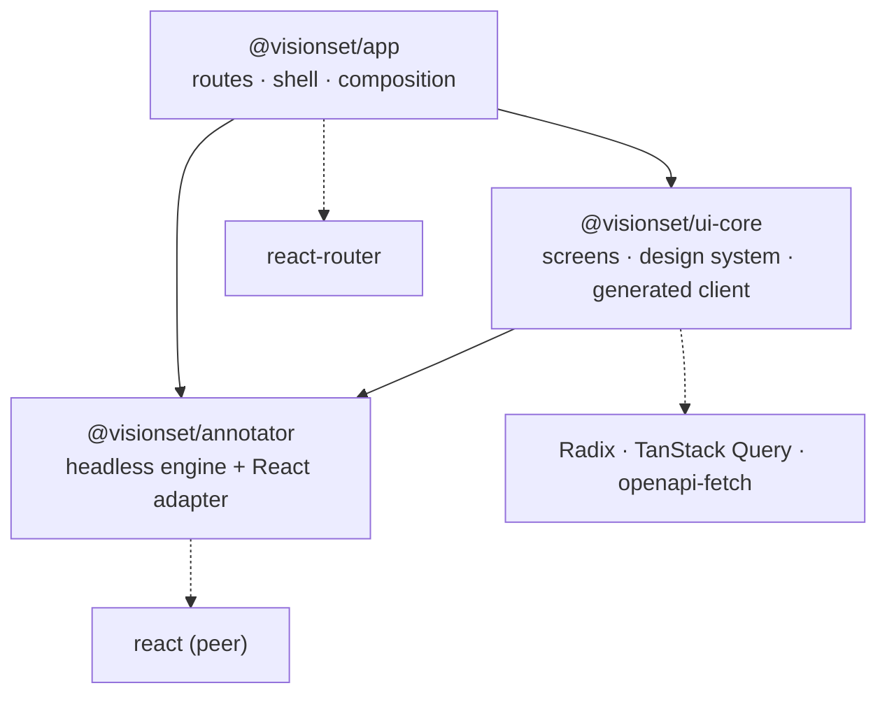

# The frontend

[`frontend/`](../../../../frontend/) is a pnpm workspace containing three packages.
The division is architectural, not merely a build convenience: each package is
defined by what it is *allowed to know*.

## The three packages



Arrows are `dependencies` in each `package.json`. The interesting part is what is
**absent** from each one:

| Package | Depends on | Never |
| --- | --- | --- |
| [`annotator`](annotator.md) | nothing at runtime; `react` is an optional peer | HTTP, a design system, a router |
| [`ui-core`](ui-core.md) | `@visionset/annotator`, Radix, TanStack Query, `openapi-fetch` | a router |
| [`app`](app.md) | both of the above, `react-router` | domain logic |

Read down the right-hand column and the architecture falls out. The annotator
ships with **zero runtime dependencies**, so an application can embed it without
inheriting a stack. `ui-core` imports no router, so a screen takes navigation as a
callback and works inside anybody's tree. The app is shell only, so a capability
that lands there instead of in `ui-core` is an architecture bug by definition -
the future enterprise UI could not reuse it.

## What the workspace runs

```
pnpm -r build     # tsc, and vite for the app
pnpm -r test      # vitest
pnpm -r lint      # eslint, plus the annotator's two typecheck passes
```

`bash scripts/check.sh` runs all three, plus the two browser suites in chromium.

The bundle the app produces is copied into `src/visionset/_static/` and served by
`visionset server` under `/app`, which is why one `pip install` is the whole
product.

## Where to go next

- [annotator.md](annotator.md) - the headless engine and the boundary that keeps
  it headless.
- [ui-core.md](ui-core.md) - screens, the design system, and the generated client.
- [app.md](app.md) - the router shell.

[`DESIGN.md`](../../../../DESIGN.md) is the visual contract and the file to read
before building any screen; the product's own UI rules are
[`docs/content/ui/product-principles.md`](../../ui/product-principles.md),
[`docs/content/ui/navigation.md`](../../ui/navigation.md) and
[`docs/content/ui/annotator.md`](../../ui/annotator.md). [`docs/content/ui.md`](../../ui.md) covers
how the browser client talks to the API. [`docs/content/annotations.md`](../../annotations.md)
covers the annotator's own behaviour.
