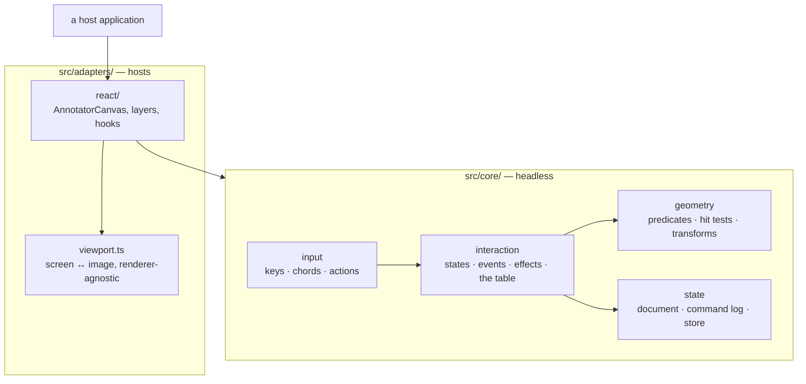

# @visionset/annotator

[`frontend/annotator/`](../../../../frontend/annotator/) is the annotation engine. Its
whole claim is that the part which *decides* anything - geometry, hit testing, the
interaction state machine, undo - is pure TypeScript that has never heard of a
browser, and React is one renderer over the top of it.

## The boundary

`src/core/` may not import React and may not name a browser global. Everything
that needs one lives in `src/adapters/`. `viewport.ts` sits at the adapter root
rather than under `react/` because it is arithmetic, and arithmetic has no host.

## Three gates, and each catches something the others cannot

All three run under `pnpm --filter @visionset/annotator lint`.

| Gate | Where | Catches |
| --- | --- | --- |
| `no-restricted-imports` | [`eslint.config.js`](../../../../frontend/annotator/eslint.config.js), scoped to `src/core/**` | a React import |
| `no-restricted-globals` | same file, same scope | a browser host object used as a **value** |
| `tsconfig.core.json` | [`tsconfig.core.json`](../../../../frontend/annotator/tsconfig.core.json) | a DOM type in a **signature** |

The third is the one worth understanding. It compiles the shipped engine with
`lib: ["ES2022"]` and `types: []` - no DOM library, no ambient `@types` - so
`function onKey(e: KeyboardEvent)` inside core fails to compile. A lint rule
reading *value* references is structurally blind to that, because a type
annotation is not a value reference, and it is exactly the shape that leaked into
v1's supposedly-pure layer.

That each gate actually fires is itself proved:
[`tests/scripts/annotator_boundary.test.mjs`](../../../../tests/scripts/annotator_boundary.test.mjs)
introduces a violation of each and asserts the corresponding gate rejects it.

## How a host talks to it

The engine takes wire-shaped input and hands back wire-shaped output, with no
mapping layer: `src/core/types.ts` mirrors the API's own shapes - `snake_case`
fields, geometry nested under its own key, points as `[x, y]` pairs - and
`src/core/wire.ts` parses `unknown` into them.

What travels the other way is a document, never HTTP. `AnnotatorCanvas` fetches
nothing; a host reads the annotations, hands them over, and writes back what the
store reports. That is the same split the suggest tool has: the engine owns the
*shape* of a suggestion session and the host owns the request.

### A new wire field is not additive here

`parseAnnotation` checks the key set **exactly**: a payload carrying a field the mirror does
not declare is *refused*, not ignored. That is what makes the mirror a contract rather than a
suggestion, and the consequence is that adding a field to a kernel wire model is a breaking
change to this client until every mirror moves with it, **in the same commit**:

| Where | What moves |
| --- | --- |
| [`src/visionset/server/models.py`](../../../../src/visionset/server/models.py) | the field on `AnnotationOut`, and the `visionset/wire/`, MCP and CLI projections |
| [`frontend/annotator/src/core/types.ts`](../../../../frontend/annotator/src/core/types.ts) | the field on `Annotation` |
| [`frontend/annotator/src/core/wire.ts`](../../../../frontend/annotator/src/core/wire.ts) | `ANNOTATION_KEY_SET` **and** the `parseAnnotation` body |
| [`frontend/ui-core/src/annotator/jobQueries.ts`](../../../../frontend/ui-core/src/annotator/jobQueries.ts) | `WireAnnotation`, which is a second mirror on purpose |

Then regenerate the fixture — `uv run python scripts/export_wire_fixtures.py` writes
`tests/fixtures/wire_annotations.json` from the same pydantic models `openapi.json` comes
from — and give any in-core factory a value. Never hand-write a TypeScript copy of a kernel
shape: extend the exporter and regenerate, which holds both gates in step.

A field the *service* stamps stays off `AnnotationCreate`/`AnnotationUpdate`. A field a client
could set and never observe is a lie in the schema.

## Zero runtime dependencies

`package.json` has no `dependencies` at all, and `react` is an optional
`peerDependency` used only by the adapter. An application embedding the engine
inherits nothing - which is also why the styled annotation panel lives in
`ui-core` and not here: a design system inside `adapters/react` would be the first
thing an embedder had to fight.

## Related

[`docs/content/annotations.md`](../../annotations.md) covers the behaviour - the tools,
the shortcut table, the ceiling on zoom.
