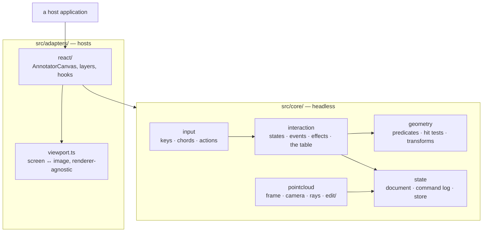

# @visionset/annotator

[`frontend/annotator/`](../../../../frontend/annotator/) is the annotation engine. Its
whole claim is that the part which *decides* anything - geometry, hit testing, the
interaction state machine, undo - is pure TypeScript that has never heard of a
browser, and React is one renderer over the top of it.

## The boundary

```mermaid
flowchart TB
    subgraph Core["src/core/ — headless"]
        Geometry["geometry\npredicates · hit tests · transforms"]
        Interaction["interaction\nstates · events · effects · the table"]
        State["state\ndocument · command log · store"]
        Input["input\nkeys · chords · actions"]
        PointCloud["pointcloud\nframe · camera · rays · edit/"]
    end

    subgraph Adapters["src/adapters/ — hosts"]
        Viewport["viewport.ts\nscreen ↔ image, renderer-agnostic"]
        ReactAd["react/\nAnnotatorCanvas, layers, hooks"]
    end

    Host["a host application"]

    Interaction --> Geometry
    Interaction --> State
    Input --> Interaction
    PointCloud --> State
    ReactAd --> Core
    ReactAd --> Viewport
    Host --> ReactAd
```

`src/core/` may not import React and may not name a browser global. Everything
that needs one lives in `src/adapters/`. `viewport.ts` sits at the adapter root
rather than under `react/` because it is arithmetic, and arithmetic has no host.

## Three gates, and each catches something the others cannot

All three run under `pnpm --filter @visionset/annotator lint`.

| Gate | Where | Catches |
| --- | --- | --- |
| `no-restricted-imports` | [`eslint.config.js`](../../../../frontend/annotator/eslint.config.js), scoped to `src/core/**` | a React import |
| `no-restricted-globals` | same file, same scope | a browser host object used as a **value** |
| `tsconfig.core.json` | [`tsconfig.core.json`](../../../../frontend/annotator/tsconfig.core.json) | a DOM type in a **signature** |

The third is the one worth understanding. It compiles the shipped engine with
`lib: ["ES2022"]` and `types: []` - no DOM library, no ambient `@types` - so
`function onKey(e: KeyboardEvent)` inside core fails to compile. A lint rule
reading *value* references is structurally blind to that, because a type
annotation is not a value reference, and it is exactly the shape that leaked into
v1's supposedly-pure layer.

That each gate actually fires is itself proved:
[`tests/scripts/annotator_boundary.test.mjs`](../../../../tests/scripts/annotator_boundary.test.mjs)
introduces a violation of each and asserts the corresponding gate rejects it.

## How a host talks to it

The engine takes wire-shaped input and hands back wire-shaped output, with no
mapping layer: `src/core/types.ts` mirrors the API's own shapes - `snake_case`
fields, geometry nested under its own key, points as `[x, y]` pairs - and
`src/core/wire.ts` parses `unknown` into them.

What travels the other way is a document, never HTTP. `AnnotatorCanvas` fetches
nothing; a host reads the annotations, hands them over, and writes back what the
store reports. That is the same split the suggest tool has: the engine owns the
*shape* of a suggestion session and the host owns the request.

### A new wire field is not additive here

`parseAnnotation` checks the key set **exactly**: a payload carrying a field the mirror does
not declare is *refused*, not ignored. That is what makes the mirror a contract rather than a
suggestion, and the consequence is that adding a field to a kernel wire model is a breaking
change to this client until every mirror moves with it, **in the same commit**:

| Where | What moves |
| --- | --- |
| [`src/visionset/server/models.py`](../../../../src/visionset/server/models.py) | the field on `AnnotationOut`, and the `visionset/wire/`, MCP and CLI projections |
| [`frontend/annotator/src/core/types.ts`](../../../../frontend/annotator/src/core/types.ts) | the field on `Annotation` |
| [`frontend/annotator/src/core/wire.ts`](../../../../frontend/annotator/src/core/wire.ts) | `ANNOTATION_KEY_SET` **and** the `parseAnnotation` body |
| [`frontend/ui-core/src/annotator/jobQueries.ts`](../../../../frontend/ui-core/src/annotator/jobQueries.ts) | `WireAnnotation`, which is a second mirror on purpose |

Then regenerate the fixture — `uv run python scripts/export_wire_fixtures.py` writes
`tests/fixtures/wire_annotations.json` from the same pydantic models `openapi.json` comes
from — and give any in-core factory a value. Never hand-write a TypeScript copy of a kernel
shape: extend the exporter and regenerate, which holds both gates in step.

A field the *service* stamps stays off `AnnotationCreate`/`AnnotationUpdate`. A field a client
could set and never observe is a lie in the schema.

## The rotated box

`obb` is a 2D shape in the same machine as `bbox`. Its arithmetic is `core/geometry/obb.ts`: the
canonical spelling, a port of the kernel's `canonical_obb` that is a fixed point on a canonical
value, the corners, the hit test, the eight grips in the box's turned frame and the rotation
grip beyond the side facing most upward (`Tolerances.rotateOffset`, from `ROTATE_HANDLE_OFFSET_PX`), and the pure resize, rotate and
move functions. The machine adds `drawing-obb` and `rotating`, and `resizing` takes a box or a
rotated box; a drag previews raw values and the release commits `canonicalObb`, so the document
holds only canonical boxes. The wire parser does not canonicalize, so a stored box round-trips
byte for byte.

## The scan editor is a sibling, not a widening

A point-cloud scan's labels are cuboids and polylines in the frame its source declares, and they are edited
by a second engine under `src/core/pointcloud/edit/` rather than by pushing 3D through the
image engine. `Geometry`, `Annotation` and the image interaction machine stay 2D, so every
dispatch over them stays exhaustive without a 3D arm; the 3D variants never enter
`AnnotationDocument`.

A raster `mask` annotation (`{type: "mask", size: [height, width], counts}`, COCO compressed RLE)
is carried untouched in the same way: it parses as a `StoredGeometry`, `documentFromWire` leaves it
out of the scene, nothing draws, selects or edits it, and it goes back unchanged on save;
`parseGeometry` refuses it explicitly.

A `keypoints` annotation (`{type: "keypoints", points, visibility?}`, pixel points in order) is
carried the same way and rendered read-only: `parseLabelClass` reads the class's keypoint spec
(`LabelClass.keypoints`, `null` when unset), `keypointLabels` (pure, in core) turns the carried
annotations into the points and spec edges to draw, and the React adapter's `KeypointLayer` draws
them beneath the committed annotations, as `Overlay3DLayer` draws projected 3D labels. Nothing
hit-tests, selects or edits a keypoint; there is no keypoint drawing tool yet. It goes back
unchanged on save, and `parseGeometry` refuses it explicitly.

| Piece | Image engine | Scan editor |
| --- | --- | --- |
| Document | `AnnotationDocument` (`documentFromWire`) | `ScanDocument` (`scanDocumentFromWire`), `cuboid_3d` and `polyline_3d` |
| History, preview, selection | `CommandLog`, `AnnotatorStore`, `Selection` | the same classes, generic over the document |
| Picking | `geometry/hitTest` in asset pixels | `pointcloud/ray` (screen to ray, ray vs ground and cuboid) and `edit/scene` (handles, vertices, segments, bodies) |
| Machine and effects | `interaction/machine`, `Effect` | `edit/machine`, `ScanEffect`, `runScanEffects` |
| Save | `planSave` | `planScanSave` |

The two save plans are disjoint over one scan: `planSave` carries every 3D label past, and
`planScanSave` carries past everything that is not a cuboid or a 3D polyline, so a page can send both through
the same job-scoped calls. The scan plan wraps a yaw into `[-π, π]`, because the kernel
refuses one outside rather than wrapping it, and sends the stored provenance, so an edited
import stays `import`.

On a scan, `yaw` turns about the declared frame's up axis. `pointcloud/cuboid` owns every box
derivation in that convention: the up axis (`upAxis`), the box's axes (`cuboidAxes`), its corners
(`cuboidCorners3D`, which the drawn labels and the overlay's footprint both read), a drawn box
standing on its base (`standingCuboid`) and the yaw of a heading (`yawOfHeading`). An edit
therefore writes back exactly what the viewer read and no coordinate is re-expressed in another
frame.

A `PointSample` holds its positions relative to its `origin`; every `PointBounds` is in the scan's
frame. `boundsOf` and `framingBounds` both take the origin, so a box measured from a
georeferenced sample cannot aim the camera at the frame's zero. A source that declares no
frame is drawn in a default frame while the kernel refuses every 3D write on it, so
`scanEditability` reports editing off there, with the reason.

In a host, `PointCloudCanvas` takes `editing`: primary presses then go to `onScanPointer` with
the camera and the CSS-pixel viewport they were made through (`scanPointerRole` decides which
button edits, orbits or pans), and `onCameraChange` reports every camera move. `useScanEditor`
turns those events through the machine against the store, and `scanHandleLayout` places the
selected box's handles with the same `screenOf` the hit test measures against. Selected and
draft boxes go through the canvas's one lines buffer, flagged with an `emphasis` that draws them
in `highlightColor`. In `ui-core`, `useScanWorkspace` holds the scan store beside the image
store on the annotation page, and `mergePlans` joins the two save plans into one dirty state.

Unlike the image machine, the scan machine takes `undo` and `redo` as events, so every surface
sends one `useScanEditor.undo` / `redo`: a draft steps back in the state and leaves the history
alone, a drag emits `discard` before the `undo` or `redo` effect, and at rest the effect alone
reaches the store. Each drag state also keeps `committed`, the label's geometry when it began,
and ends with a `discard` once the committed document no longer holds an equal geometry (compared by
value, so a change to another label or a re-stored copy leaves the drag alone), so a host
that walks the history behind the machine never has a drag rebuilt from a stale origin.

The top-down view is a second `PointCloudCanvas` with `pinned`: its camera is `topDownCamera`,
straight down the up axis and **orthographic** (`OrbitCamera.projection`), because a perspective
camera that close draws a box's top visibly larger than its footprint. `ndcRay`, `screenOf`,
`metresPerPixel` and `viewProjection` each take the orthographic case, so the machine, the hit
test and `scanHandleLayout` are unchanged. The orthographic near plane and the picking ray's
start share `ORTHOGRAPHIC_STANDOFF`, so what is drawn above the eye is exactly what can be picked. It follows the perspective camera's target through
`followTarget` and turns its orbit drag into a pan (`scanPointerRole(…, pinned)`). Both views feed
the one `useScanEditor`; each `ScanView` names its `kind`, which reaches the machine as
`Scene3D.view`. A `top-down` view offers only the four side faces (`handleFaces`) and never reads
a height, so a draw can take its footprint there and its height in the perspective view.

Polylines use the same machine, store and save plan. The machine adds a `drawing-polyline`
state (the vertices placed so far and the cursor, previewed through `draftPolyline`) and a
`moving-vertex` state; vertex edits are the pure `pointcloud/polyline` functions
(`movePolylineVertex`, `insertPolylineVertex`, `removePolylineVertex`, `isDrawablePolyline`).
A vertex placed, inserted or dragged takes its height from the scan through `snapHeight`
(`pointcloud/snap`): the point nearest the pointer on screen within `SNAP_TOLERANCE_PX`, the one
nearest the eye among those within `SNAP_NEAR_EQUAL_PX` of the nearest, and the vertex is then the
pointer ray's `rayGroundHit` at that height, so it stays under the pointer. With no point that
close it falls back to `rayGroundHit` at the ground height, or, for a drag, at the vertex's own
level. The machine reads the points through the optional `ScanContext.points`, which the host
sets from the loaded `PointSample`. A query projects only the points of a level grid's cells the
ray passes over, widened by the tolerance at each depth; the grid is built once per sample and up
axis (index and sign), in its origin-relative coordinates, and kept in a `WeakMap` keyed by the
sample. Its cells span the 2nd–98th percentile of the two level axes, a point beyond that range
kept in the nearest edge cell, so one stray return does not coarsen every cell; a point with a
non-finite coordinate is left out. `commit` (Enter, or a double-click the
adapter maps to it) adds the line only when it has two vertices not all equal, the kernel's
rule, and otherwise keeps drafting. `hitTest3D` tries the selected label's handles first - a
polyline's vertices or a cuboid's faces and yaw ring - then any polyline's segments, then cuboid
bodies. A press on a segment of the selected polyline inserts a vertex and drags it as one
command; alt on a vertex removes it, refused below two; alt anywhere else does nothing; a removal
or drag that `isDrawablePolyline` rejects is refused, so the document never holds a line the kernel
would refuse; `delete-selected` removes whole labels. A polyline is created with `visibility`
omitted, which the kernel reads as unknown; a declared visibility stays aligned with the points,
an inserted vertex taking `UNLABELED`. `scanVertexLayout` places the vertex handles with the same `screenOf` as the hit test.

The package root exports everything a `pointcloud` module exports, so a family is public whole
or not at all (`zoom` with `zoomAt`, `orthographic` with `perspective`, `lookAt` and `multiply`,
every `POINT_BUFFER_*` and `POINT_FLAG_*` constant). Two exceptions stay internal: the three-vector
arithmetic of `pointcloud/vector`, and the snap grid behind `snapHeight` (`surfaceGrid`).

## Zero runtime dependencies

`package.json` has no `dependencies` at all. The root entrypoint is headless and never
imports `react`; the React adapter is the separate `@visionset/annotator/react` subpath, and
`react` is an optional `peerDependency` needed only by that subpath. `ui-core` and the app
consume both. An application embedding the engine inherits nothing - which is also why the styled annotation panel lives in
`ui-core` and not here: a design system inside `adapters/react` would be the first
thing an embedder had to fight.

## Related

[`docs/content/annotations.md`](../../annotations.md) covers the behaviour - the tools,
the shortcut table, the ceiling on zoom.
