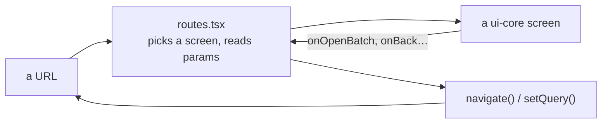

# @visionset/app

[`frontend/app/`](../../../../frontend/app/) is the shell: routes, layout,
composition - and the one place in the workspace that knows the product's data
arrives over HTTP from a server at a URL. It is deliberately the thinnest package
that could own that, never the thickest.

## What lives here and nowhere else

`src/data/ossClient.ts` is `@visionset/ui-core`'s `VisionSetDataClient` port,
implemented with `openapi-fetch` and a bearer token - the only module in the
repository that constructs one. `src/data/OssSession.tsx` is the credential and
session state machine above it: the four-state probe (`checking`, `session`,
`token`, `none`) that asks `GET /session` once per mount, and the opaque
authorization/data scope that state machine hands to `VisionSetDataProvider`.
`src/shell/TokenGate.tsx` is
the form that appears when the server will not sign the browser in on its own.

The rail's collapsed/expanded state - `src/shell/railState.ts`, read on mount and
written back on toggle - and the rail's own layout widths,
`--spacing-sidebar`/`--spacing-sidebar-collapsed` in `src/styles.css`, are the
app's too: a host mounting VisionSet's screens brings its own global navigation,
so nothing reusable needs to read the standalone shell's rail.

None of this is domain logic. `@visionset/ui-core` declares only the shape a host
must satisfy - `VisionSetDataClient` and `VisionSetDataProviderProps` - and never
how a credential is obtained or a session probed; this package is that shape's one
implementation in this repository.

The composition root supplies a second runtime the same way: `VisionSetMediaRuntime`
(`ui-core`'s `media/port.ts`) needs a materializer and a `FrameSink`, and this package
is the only place both are wired together. The materializer is
`MediabunnyVideoMaterializer` from `@visionset/media/mediabunny`, used unmodified - a
host does not get its own decoder, it gets the one reusable package. The `FrameSink`
is this repository's own: `src/data/` builds one backed by the existing
`VisionSetDataClient`, posting materialized frames as multipart chunks over the same
transport `ossClient.ts` already speaks, to `VideoImportService`'s session endpoints.
Nothing about the materializer or the sink protocol is enterprise-specific - a
managed host replaces only the `FrameSink`'s destination, the same way it replaces
`ossClient.ts` today, which is what proves the boundary actually sits where
[ui-core.md](ui-core.md) says it does.

The browser-model acquisition system is composed here for the same reason. The public
registry and immutable manifests are discovery data, **not a trust anchor**. The app validates
their schema and intersects them with a build-owned admission catalog that pins the model ID,
revision, graph contract, source and license metadata, artifact roles, byte counts and SHA-256
digests. Registry entries the build cannot execute are not offered. Registry metadata cannot
name code, dynamic imports, preprocessing functions, or paths outside the configured public
model base.

An explicit Download action fetches admitted artifacts. Every complete download is checked for
its pinned size and digest before any byte is written to the versioned Cache Storage namespace;
unverified or partial models are never installed. Storage keys include the model revision and
artifact digest, so mirrors of identical immutable content share an identity without confusing
different revisions. Activation reads the whole admitted set back and repeats both checks. A
missing or corrupt entry is removed and leaves the model unavailable; activation never turns
that failure into a network download.

The catalog and the execution port deliberately answer different questions. Catalog states
describe known, downloading, installed, activating, ready, and failed models. `listTargets()`
continues to list only models that can answer now. Startup inspects storage but creates no ONNX
Runtime worker or session. A cached model activates lazily when the armed Suggest surface needs
the selected target; runtime sessions and image embeddings remain memory-only. Removal first
invalidates and disposes that runtime, then deletes only the admitted revision's model
artifacts.

Cache Storage is a browser-managed persistence layer, not a permanence guarantee. If a verified
download cannot be written, the app may run it for that session while stating that it was not
saved. An admitted cached model can be verified and activated when registry and artifact routes
are unavailable, while Server inference remains independent of the catalog and public model
source. No service worker, Python-side browser cache, or automatic revision update participates
in this flow.

## What a route does

A route is allowed to decide *which* screen renders and *what its parameters are*,
and nothing else: no fetching, no domain logic, no error interpretation. The
screen reports what happened through a callback and the route spells the URL.

That is the enterprise rule, and it is worth stating as a test rather than an
aspiration: **a capability that lands here instead of in `ui-core` is an
architecture bug**, because the future enterprise UI cannot reuse it.

## Three regions, and the boundary between them is the credential

| Region | Routes | Inside the token gate? |
| --- | --- | --- |
| the product | `/`, `/projects`, `/projects/:projectId`, `/models`, ... | yes |
| the annotator showcase | `/demo` | **no** |
| the design system | `/styleguide` | **no** |

The last two need no server and no credential - the showcase's picture is a
`data:` URI and the styleguide is pure CSS - so putting them behind the gate would
ask for a token to look at a page that cannot use one. It is also what lets the
browser suite run with no backend at all.

## Structural navigation, never history

Every sub-view names its parent in one table, `PARENT` in
[`routes.tsx`](../../../../frontend/app/src/routes.tsx). A back affordance wired to
`navigate(-1)` means a different thing depending on how the page was reached - it
leaves the app on a fresh tab, and after walking forward through several frames it
walks back through them one at a time.

[`frontend/app/e2e/navigation.spec.ts`](../../../../frontend/app/e2e/navigation.spec.ts)
holds it, and the method is the assertion: every scenario navigates **by URL** and
signs in there, so history is empty and only a structural parent can satisfy it.

## What runs in a browser

| Suite | Config | What it is for |
| --- | --- | --- |
| `e2e/` | `playwright.config.ts` | the app and the annotator against a stubbed API |
| `cycle/` | `playwright.cycle.config.ts` | the whole cycle against a **real server and a real kernel** |
| `bench/` | `playwright.bench.config.ts` | frame times, run by hand, never in a default gate |

The first two are what `bash scripts/check.sh browser` runs. They exist because
jsdom reports every element as 0×0, so anything about layout, a `ResizeObserver`,
or a real focus move is a claim only a browser can check - a component test in
jsdom would assert the broken value as though it were the design.

Each worktree derives its own three ports from its absolute path
([`e2e-ports.ts`](../../../../frontend/app/e2e-ports.ts)), so two checkouts can run
their gates at the same time.

## Related

[`docs/content/ui.md`](../../ui.md) covers the client's behaviour.
[`docs/content/ui/navigation.md`](../../ui/navigation.md) is the canonical sitemap, and it
has to be updated in the same change as any route that moves.
