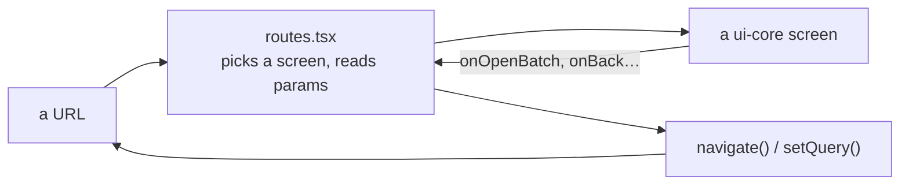

# @visionset/app

[`frontend/app/`](../../../../frontend/app/) is the shell: routes, layout,
composition. It is deliberately the thinnest package in the repository.

## What a route does

A route is allowed to decide *which* screen renders and *what its parameters are*,
and nothing else: no fetching, no domain logic, no error interpretation. The
screen reports what happened through a callback and the route spells the URL.

That is the enterprise rule, and it is worth stating as a test rather than an
aspiration: **a capability that lands here instead of in `ui-core` is an
architecture bug**, because the future enterprise UI cannot reuse it.

## Three regions, and the boundary between them is the credential

| Region | Routes | Inside the token gate? |
| --- | --- | --- |
| the product | `/`, `/projects`, `/projects/:projectId`, `/inference`, ... | yes |
| the annotator showcase | `/demo` | **no** |
| the design system | `/styleguide` | **no** |

The last two need no server and no credential - the showcase's picture is a
`data:` URI and the styleguide is pure CSS - so putting them behind the gate would
ask for a token to look at a page that cannot use one. It is also what lets the
browser suite run with no backend at all.

## Structural navigation, never history

Every sub-view names its parent in one table, `PARENT` in
[`routes.tsx`](../../../../frontend/app/src/routes.tsx). A back affordance wired to
`navigate(-1)` means a different thing depending on how the page was reached - it
leaves the app on a fresh tab, and after walking forward through several frames it
walks back through them one at a time.

[`frontend/app/e2e/navigation.spec.ts`](../../../../frontend/app/e2e/navigation.spec.ts)
holds it, and the method is the assertion: every scenario navigates **by URL** and
signs in there, so history is empty and only a structural parent can satisfy it.

## What runs in a browser

| Suite | Config | What it is for |
| --- | --- | --- |
| `e2e/` | `playwright.config.ts` | the app and the annotator against a stubbed API |
| `cycle/` | `playwright.cycle.config.ts` | the whole cycle against a **real server and a real kernel** |
| `bench/` | `playwright.bench.config.ts` | frame times, run by hand, never in a default gate |

The first two are what `bash scripts/check.sh browser` runs. They exist because
jsdom reports every element as 0×0, so anything about layout, a `ResizeObserver`,
or a real focus move is a claim only a browser can check - a component test in
jsdom would assert the broken value as though it were the design.

Each worktree derives its own three ports from its absolute path
([`e2e-ports.ts`](../../../../frontend/app/e2e-ports.ts)), so two checkouts can run
their gates at the same time.

## Related

[`docs/content/ui.md`](../../ui.md) covers the client's behaviour.
[`information-architecture`](../../../../.agents/skills/frontend/information-architecture/SKILL.md)
is the canonical sitemap, and it has to be updated in the same change as any route
that moves.
