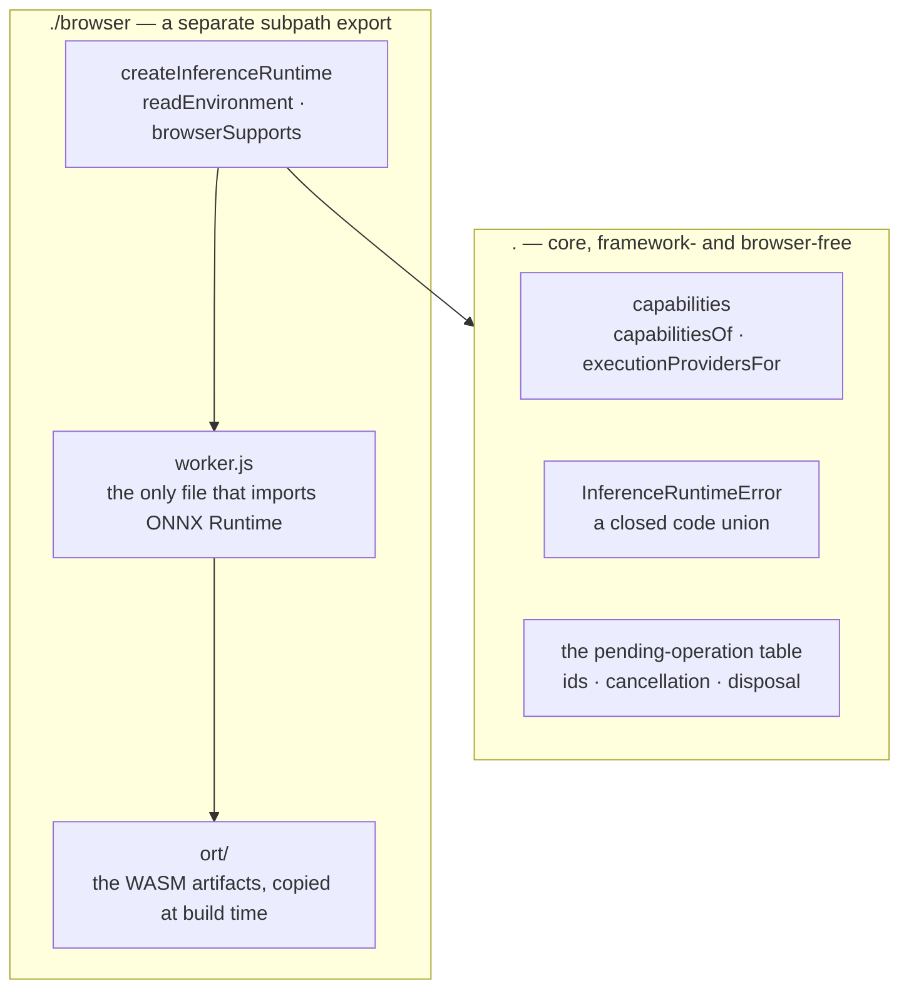

# @visionset/browser-inference

[`frontend/browser-inference/`](../../../../frontend/browser-inference/) runs model graphs in
the browser. It owns a persistent worker, ONNX Runtime Web, and a model layer that can execute a
caller-supplied EfficientSAM-Ti - and nothing else. No weights ship with the package, it offers
no UI, and it has no knowledge that VisionSet exists.

Read that last clause literally: this package depends on **no VisionSet package and no
framework**. It is the only one of the five with no edge into the workspace at all.

## What it is not

It does not implement `VisionSetBrowserInferenceRuntime`, the optional port
[`ui-core` declares](ui-core.md) for a host that can suggest on this device. That interface
belongs to `ui-core`, so implementing it here would mean this package depending on the package
that is supposed to be *injected with* runtimes - the dependency arrow pointing backwards
through the seam it exists to serve. A host that holds both adapts one to the other, which is
what [host composition](../decisions/browser-inference-is-host-injected.md) is for.

Nothing in this repository composes that adapter yet, and nothing imports this package.
**A package existing is not the product offering a browser target.** There is no "This device"
control and no user-visible change - a caller who wants EfficientSAM-Ti running still has to
supply the weights and wire the adapter itself.

## Core and adapter are two entrypoints, for the same reason as media



`package.json` declares `"."` → `dist/index.js` and `"./browser"` → `dist/browser/index.js`.
The split is the same one [`media`](media.md) makes and it buys the same property: importing
the root entrypoint is safe to evaluate anywhere, plain Node included. It is enforced three
ways rather than intended - `tsconfig.json` gives core `lib: ["ES2022"]` with no `"DOM"`, the
package's ESLint config bans the browser host globals under `src/` outside `src/browser/`, and
[`scripts/verify_npm_packages.sh`](../../../../scripts/verify_npm_packages.sh) imports the
packed tarball's core entry in real Node, where touching a browser global throws rather than
merely type-checking.

Even in the adapter, no browser global is read at module scope. `readEnvironment()` reads them
when called; the `Worker` is constructed inside `createInferenceRuntime()`.

## A model layer sits on the same split

`PromptableSegmentationRuntime` - `ready`, `prepareImage`, `suggest`, `dispose` - is a second core
type alongside `BrowserInferenceRuntime`, exported from the root entrypoint next to `EFFICIENT_SAM_TI`'s
frozen constants. Its implementation, `createEfficientSamRuntime()`, lives only in `./browser`
and shares `startWorker()` with `createInferenceRuntime()`: the same capability read, the same
worker construction, the same synchronous refusals. Only the facade differs - one speaks graph
ids and tensors, the other speaks points and masks.

There are two calls because the model is two graphs of very different cost. `prepareImage` runs
the encoder once per image and keeps its output - the embedding - inside the worker; it is never
returned to the caller and never crosses the boundary again. `suggest` runs only the decoder,
against that kept embedding, for every point after the first. Keeping the embedding worker-side
is what makes a refinement cheap instead of a second full run of the expensive graph, and what
that costs and forbids is recorded in
[the image embedding stays in the worker](../decisions/the-image-embedding-stays-in-the-worker.md).
That embedding is the only tensor the worker keeps: what the decoder answers with - the candidate
masks and their scores - belongs to the one `suggest` that asked for it and is released before
that call returns, so a long session of refinements retains one embedding rather than a set of
full-size mask planes per click. `dispose()` ends the runtime the same way
`BrowserInferenceRuntime`'s does.

The worker holds exactly one prepared image at a time. Preparing a second supersedes the first:
the handle a caller still holds for the old image stops answering, and a `suggest` against it
fails with `image-superseded` rather than silently describing the new image. There is no cache
behind that one slot - a caller who wants two images ready at once holds two runtimes.

EfficientSAM-Ti takes at most six points because its decoder graph does. A prompt over that limit
is refused outright rather than trimmed to the first six: trimming would answer a prompt the
caller never sent, with nothing to tell them their later points were dropped.

A prompt with even one negative point is refused for a sharper reason than the count.
EfficientSAM-Ti defines no negative point at all: its prompt encoder assigns a learned type
embedding to labels `-1`, `1`, `2` and `3`, and nothing to `0`, the label original SAM uses for a
background click. A point sent as a negative therefore carries no polarity information into the
graph, and the model has no way to express exclusion. Measured on the exported graph, such a
point *expanded* the mask rather than carving a hole in it, landing within 0.24% of what the same
point does labelled positive - which is evidence that the behaviour is not exclusion, not
evidence that `0` means positive. The model defines no meaning for it either way, so a prompt
carrying one is refused rather than answered with something that is not what was asked for.
`PointPrompt.negative` stays on the shared type regardless, as the seam a future model with an
actual background class reads from.

That refusal is a real limit on what this model can stand in for, and it is worth stating plainly
rather than leaving to be discovered. VisionSet's server-side `point_suggest` interaction is
defined in terms of positive *and* negative points; EfficientSAM-Ti supports positive points and
multi-positive refinement only. It is the engineering model for this phase - the thing that
proved the export, the worker-resident embedding and the browser execution path are real - and
not yet a semantically complete replacement for that capability. Which model eventually becomes a
browser default is a later decision, and negative-point support is one of the criteria it has to
be made against.

`prompt-rejected` is not only a prompt code: `prepareImage` raises it the same way for an image
with a non-positive or non-integer width or height, or a byte count that does not match
`width * height * 3` — a malformed image is something this model cannot be expressed to run on,
for the same reason an over-long or negatively-pointed prompt is not.

The decoder answers with several candidate masks and one confidence score per candidate;
`suggest` keeps only the highest-scoring one. What it returns is a raw binary mask - one byte per
pixel, `0` or `1` - not a polygon, a bounding box, or any other application geometry. Turning a
mask into geometry a batch schema accepts happens the same way regardless of which runtime
produced it, and does not happen here.

Neither graph's bytes live in this package. `createEfficientSamRuntime()` takes `encoder` and
`decoder` as caller-supplied `Uint8Array`s and transfers them into the worker; where a host gets
them is the host's problem. The graphs this repository tests against are produced by
[`scripts/browser_models/efficientsam/`](../../../../scripts/browser_models/efficientsam/), which
exports EfficientSAM-Ti's encoder and decoder from the pinned upstream checkpoint and checks the
exported graph against the eager PyTorch reference it came from.

## The worker is persistent

One worker per runtime handle, from `createInferenceRuntime()` to `dispose()`, carrying every
loaded graph for that whole span. `media` terminates its worker after each operation; this one
must not, because everything expensive about inference is state that lives *between* operations
- a loaded session, and later an image embedding a second click reuses.

That inversion, and the three obligations it creates, are recorded in
[the inference worker is persistent](../decisions/the-inference-worker-is-persistent.md). The
shortest of them is also the most load-bearing: **every asynchronous request carries an
operation id, and a reply whose id is not in the pending table is dropped.** Cancellation
safety, late-reply safety and post-disposal safety are all that one rule seen from different
angles.

A runtime operation id is not the annotator's suggestion serial. One protects routing, the
other protects what is on screen, and a correctly routed answer can still be stale.

Because a persistent worker outlives any one operation, and operation ids are never reused,
the worker cannot afford to remember a `cancel` forever. It tracks only the ids it still owns -
queued or running - and a `cancel` for anything else, including one that raced a `result` the
worker already sent, is ignored rather than recorded. The other half of the same bound is that
every way out of an operation releases both records: a run that was cancelled while ONNX Runtime
was working and *then* failed reaches none of the checks that would otherwise clear the marker,
so the release happens on the way out rather than on the paths that happen to look.

## Execution policy

The runtime chooses execution providers from a policy and a capability reading, and hands the
list to ONNX Runtime:

| Policy | Providers | What a caller may conclude |
| --- | --- | --- |
| `prefer-webgpu` *(default)* | `webgpu`, `wasm` | that it ran. **Not** where - ONNX Runtime falls back per operator, silently and correctly. |
| `require-webgpu` | `webgpu` | that WebGPU ran, or that it refused. This is the only configuration under which "WebGPU executed" is a checkable claim. |
| `wasm-only` | `wasm` | that it ran on the CPU, deterministically. |

Capability detection is a pure function over an injected record of environment facts, not a
cached singleton, so every branch is reachable from a test. It reports what *appears available*
and deliberately claims no more: `hasWebGpu` means `navigator.gpu` exists. It does not mean an
adapter can be acquired, a device will be granted, or a given model will run. Offering a
control on the strength of a stronger reading is exactly the failure
[a connection is not a browser](../decisions/a-connection-is-not-a-browser.md) exists to
prevent, one layer down.

WASM works without cross-origin isolation. When `crossOriginIsolated` is false the runtime uses
a single WASM thread - slower, and correct. No COOP/COEP headers are added anywhere in
VisionSet for this.

There is no WebGL path. WebNN is out of scope.

## Failure has a vocabulary

`InferenceRuntimeError` carries a `code` from a closed union - `unsupported-runtime`,
`worker-initialization-failed`, `worker-crashed`, `webgpu-unavailable`, `graph-load-failed`,
`runtime-execution-failed`, `cancelled`, `disposed` - and preserves the original exception as
`cause`. ONNX Runtime's own message text is diagnostics, never the contract: a caller switches
on `code`, a developer reads `cause`. Codes cross the worker boundary as strings and are rebuilt
on the main thread, so a caller cannot tell which side failed, which is the point.

`worker-initialization-failed` and `worker-crashed` are both terminal, and for the same reason:
each names a failure this worker cannot come back from. A `configure` operation answering with
an ordinary error reply, or the browser `Worker` itself emitting an `error` event, moves the
runtime into a permanent failed state - every operation still pending rejects with that same
error, the worker is stopped, and every later `loadGraph()`/`run()` rejects with it immediately
and posts nothing. There is no automatic worker restart; recreating one is a caller decision,
made with a fresh `createInferenceRuntime()` call, not something this package does silently.

`ready()` is the exception, and deliberately so: it reports what initialization decided, not
whether the runtime is usable now. A runtime that configured successfully and crashed an hour
later still resolves `ready()` with the providers it agreed on, while `loadGraph()` and `run()`
reject. There is no health-probe API, because the operations already are one - a call that would
fail rejects immediately rather than hanging.

## Build output

`tsup` emits `dist/index.js`, `dist/browser/index.js` and `dist/browser/worker.js`, and a build
step copies ONNX Runtime's WebAssembly artifacts into `dist/browser/ort/`. The worker is spawned
one way only:

```ts
new Worker(new URL("./worker.js", import.meta.url), { type: "module" });
```

No `blob:`, no `data:`, no `eval`, no source strings, no remote code - a host's content-security
policy must not be the thing that breaks this. ONNX Runtime's JavaScript is bundled into the
worker rather than left as a bare specifier, because a module worker gets no import map from the
document that started it; the same reasoning is written out for `media` in
[`THIRD-PARTY-NOTICES.md`](../../../../THIRD-PARTY-NOTICES.md), which also records what
redistributing ONNX Runtime owes.

That the *packed tarball* still works - worker present, WASM artifacts beside it, core entry
importable in Node - is asserted by `verify_npm_packages.sh` on the packed bytes, not on the
workspace `dist/` a symlink would resolve.

## How it is proved

Two suites, because two claims need different evidence. `pnpm --filter
@visionset/browser-inference test` drives the whole correlation table from Node against a
controllable channel: out-of-order replies, concurrent operations, cancellation, a late reply
for a cancelled id, disposal settling everything. `pnpm --filter @visionset/browser-inference
test:browser` runs the **built** worker in a real Chromium against a generated single-node ONNX
graph, and asserts exact arithmetic.

The fixture is emitted by a small protobuf writer rather than committed as a `.onnx`, so a
reviewer can read what the model is.
