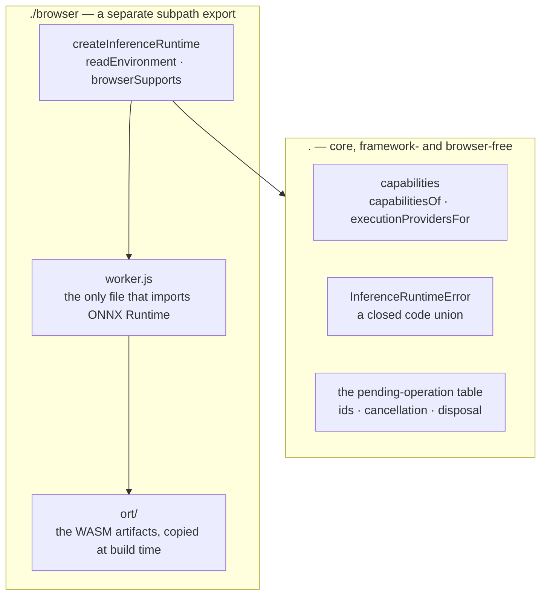

# @visionset/browser-inference

[`frontend/browser-inference/`](../../../../frontend/browser-inference/) runs model graphs in
the browser. It owns a persistent worker, ONNX Runtime Web, and nothing else - no model, no UI,
no knowledge that VisionSet exists.

Read that last clause literally: this package depends on **no VisionSet package and no
framework**. It is the only one of the five with no edge into the workspace at all.

## What it is not

It does not implement `VisionSetBrowserInferenceRuntime`, the optional port
[`ui-core` declares](ui-core.md) for a host that can suggest on this device. That interface
belongs to `ui-core`, so implementing it here would mean this package depending on the package
that is supposed to be *injected with* runtimes - the dependency arrow pointing backwards
through the seam it exists to serve. A host that holds both adapts one to the other, which is
what [host composition](../decisions/browser-inference-is-host-injected.md) is for.

Nothing in this repository composes that adapter yet, and nothing imports this package.
**A package existing is not the product offering a browser target.** There is no model, no
"This device" control, and no user-visible change.

## Core and adapter are two entrypoints, for the same reason as media



`package.json` declares `"."` → `dist/index.js` and `"./browser"` → `dist/browser/index.js`.
The split is the same one [`media`](media.md) makes and it buys the same property: importing
the root entrypoint is safe to evaluate anywhere, plain Node included. It is enforced three
ways rather than intended - `tsconfig.json` gives core `lib: ["ES2022"]` with no `"DOM"`, the
package's ESLint config bans the browser host globals under `src/` outside `src/browser/`, and
[`scripts/verify_npm_packages.sh`](../../../../scripts/verify_npm_packages.sh) imports the
packed tarball's core entry in real Node, where touching a browser global throws rather than
merely type-checking.

Even in the adapter, no browser global is read at module scope. `readEnvironment()` reads them
when called; the `Worker` is constructed inside `createInferenceRuntime()`.

## The worker is persistent

One worker per runtime handle, from `createInferenceRuntime()` to `dispose()`, carrying every
loaded graph for that whole span. `media` terminates its worker after each operation; this one
must not, because everything expensive about inference is state that lives *between* operations
- a loaded session, and later an image embedding a second click reuses.

That inversion, and the three obligations it creates, are recorded in
[the inference worker is persistent](../decisions/the-inference-worker-is-persistent.md). The
shortest of them is also the most load-bearing: **every asynchronous request carries an
operation id, and a reply whose id is not in the pending table is dropped.** Cancellation
safety, late-reply safety and post-disposal safety are all that one rule seen from different
angles.

A runtime operation id is not the annotator's suggestion serial. One protects routing, the
other protects what is on screen, and a correctly routed answer can still be stale.

## Execution policy

The runtime chooses execution providers from a policy and a capability reading, and hands the
list to ONNX Runtime:

| Policy | Providers | What a caller may conclude |
| --- | --- | --- |
| `prefer-webgpu` *(default)* | `webgpu`, `wasm` | that it ran. **Not** where - ONNX Runtime falls back per operator, silently and correctly. |
| `require-webgpu` | `webgpu` | that WebGPU ran, or that it refused. This is the only configuration under which "WebGPU executed" is a checkable claim. |
| `wasm-only` | `wasm` | that it ran on the CPU, deterministically. |

Capability detection is a pure function over an injected record of environment facts, not a
cached singleton, so every branch is reachable from a test. It reports what *appears available*
and deliberately claims no more: `hasWebGpu` means `navigator.gpu` exists. It does not mean an
adapter can be acquired, a device will be granted, or a given model will run. Offering a
control on the strength of a stronger reading is exactly the failure
[a connection is not a browser](../decisions/a-connection-is-not-a-browser.md) exists to
prevent, one layer down.

WASM works without cross-origin isolation. When `crossOriginIsolated` is false the runtime uses
a single WASM thread - slower, and correct. No COOP/COEP headers are added anywhere in
VisionSet for this.

There is no WebGL path. WebNN is out of scope.

## Failure has a vocabulary

`InferenceRuntimeError` carries a `code` from a closed union - `unsupported-runtime`,
`worker-initialization-failed`, `webgpu-unavailable`, `graph-load-failed`,
`runtime-execution-failed`, `cancelled`, `disposed` - and preserves the original exception as
`cause`. ONNX Runtime's own message text is diagnostics, never the contract: a caller switches
on `code`, a developer reads `cause`. Codes cross the worker boundary as strings and are rebuilt
on the main thread, so a caller cannot tell which side failed, which is the point.

## Build output

`tsup` emits `dist/index.js`, `dist/browser/index.js` and `dist/browser/worker.js`, and a build
step copies ONNX Runtime's WebAssembly artifacts into `dist/browser/ort/`. The worker is spawned
one way only:

```ts
new Worker(new URL("./worker.js", import.meta.url), { type: "module" });
```

No `blob:`, no `data:`, no `eval`, no source strings, no remote code - a host's content-security
policy must not be the thing that breaks this. ONNX Runtime's JavaScript is bundled into the
worker rather than left as a bare specifier, because a module worker gets no import map from the
document that started it; the same reasoning is written out for `media` in
[`THIRD-PARTY-NOTICES.md`](../../../../THIRD-PARTY-NOTICES.md), which also records what
redistributing ONNX Runtime owes.

That the *packed tarball* still works - worker present, WASM artifacts beside it, core entry
importable in Node - is asserted by `verify_npm_packages.sh` on the packed bytes, not on the
workspace `dist/` a symlink would resolve.

## How it is proved

Two suites, because two claims need different evidence. `pnpm --filter
@visionset/browser-inference test` drives the whole correlation table from Node against a
controllable channel: out-of-order replies, concurrent operations, cancellation, a late reply
for a cancelled id, disposal settling everything. `pnpm --filter @visionset/browser-inference
test:browser` runs the **built** worker in a real Chromium against a generated single-node ONNX
graph, and asserts exact arithmetic.

The fixture is emitted by a small protobuf writer rather than committed as a `.onnx`, so a
reviewer can read what the model is.
