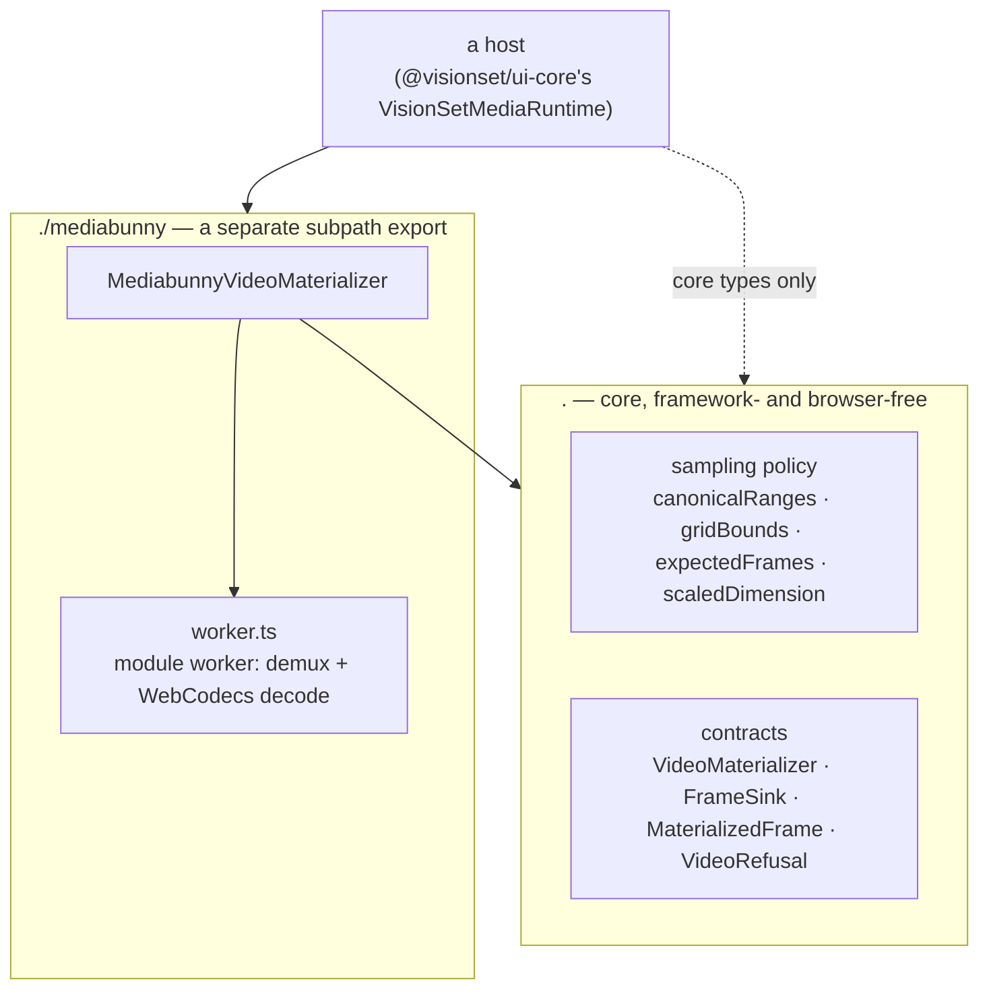

# @visionset/media

[`frontend/media/`](../../../../frontend/media/) is where a video stops being a file
and becomes JPEG assets, and it does that entirely in the browser. There is no
server-side decoder anywhere in this repository and no fallback to one - see
[backend/kernel.md](../backend/kernel.md) and the root
[architecture diagram](../README.md), which no longer name one.

## Core and adapter are two entrypoints on purpose

`package.json` declares two `exports`: `"."` → `dist/index.js` and `"./mediabunny"` →
`dist/mediabunny/index.js`. That split, not just a file layout convention, is what
keeps `import("@visionset/media")` safe to evaluate anywhere, plain Node included -
neither entrypoint touches `window`, `document`, `Worker` or `VideoDecoder` at module
scope. `mediabunny` - the third-party demuxer/decoder library, roughly 800 KB bundled -
is a plain `dependency` of this package and only reachable through `/mediabunny`. A
caller who imports the root entrypoint for the sampling arithmetic alone never loads
it; a caller who needs to actually decode a file asks for the adapter by name. This is
the same shape as the kernel's own ports-and-adapters split
([backend/kernel.md](../backend/kernel.md)), one level down: `.` is a port a consumer
can hold without paying for an implementation, `./mediabunny` is the implementation.

## The sampling policy is ported, not reinvented

`canonicalRanges`, `gridBounds`, `expectedFrames`, `gridTimestamps` and
`scaledDimension` are direct ports of the kernel's own arithmetic in
`visionset.kernel.domain.source`, not a second design for the same problem. A range
selection has to canonicalize to the same clip on both sides of the wire, and a
frame count computed in the browser has to match the count the kernel would derive
from the same ranges - so this package carries the kernel's rules across the
language boundary rather than approximating them. `SAMPLING_POLICY_VERSION` is
stamped onto everything the arithmetic produces; a future change to the grid, the
clamp or the scale rounding bumps it, so an old import's provenance stays legible
under a newer policy instead of being silently reinterpreted.

## The worker, and why it is a real file

`MediabunnyVideoMaterializer` does no decoding on the thread that calls it. It spawns
`dist/mediabunny/worker.js` with
`new Worker(new URL("./worker.js", import.meta.url), { type: "module" })` - a real
module artifact shipped in the tarball, addressed by URL, never constructed from a
`blob:` or `data:` URL. A host that sets a strict `worker-src` in its
content-security policy can allow this the same way it allows any other same-origin
script; a blob-URL worker would force that host to relax its CSP just to run VisionSet's
video import, which is exactly the kind of requirement this package refuses to
impose. The worker owns the `Input`, the decoder and the canvases for the file it is
materializing, and it tears all three down before it reports `done` - including on
cancellation - so a resolved `materialize()` call is proof the resources were
released, not just that a promise settled.

## Back-pressure is bounded, and the bound is the ack

The protocol between the main thread and the worker is small on purpose: `inspect`,
`materialize`, `ack` and `cancel` out; `inspection`, `expected`, `chunk`, `done` and
`error` back. The one that carries the architecture is `ack`. The worker decodes and
encodes at most `FRAME_CHUNK_SIZE` (8) frames, posts them as one `chunk`, and then
**stops** - it does not decode the next frame until the main thread posts `ack` back.
The main thread only sends that `ack` once the chunk has actually been handed to the
`FrameSink` and `sink.append()` has resolved.

That is the whole back-pressure mechanism, and it is deliberately not a queue, a
buffer size, or a memory watermark: a slow sink - a throttled upload, a paused tab, a
host with its own queueing - stalls the decoder instead of the decoder racing ahead
and filling the worker's heap with encoded frames nobody has accepted yet. `FrameSink`
is the same interface a host supplies through `@visionset/ui-core`'s
`VisionSetMediaRuntime` (see [ui-core.md](ui-core.md)), so the sink that produces the
ack is always the host's, never this package's own guess at a reasonable buffer.

**There is no `progress` message, and that follows from the same rule.** The worker
announces `expected` once, before the first chunk, and never reports a running count:
it decodes ahead of delivery by up to one chunk and a `cancel` throws that lead away,
so a number it sent would describe frames the sink may never be handed. Progress is
therefore derived on the main thread - `expected` from the worker, the delivered count
from the chunks the sink actually took - which is the only place both halves are known.

## Frames are JPEG, and the quality is 0.95

`VIDEO_FRAME_MEDIA_TYPE` and `VIDEO_FRAME_QUALITY` in the core entrypoint are the
whole of it: one encoding, not a choice, and the server refuses anything else
(`VIDEO_FRAME_FORMAT` in the kernel).

The pixels leaving a decoder have already been through H.264, HEVC, VP9 or AV1. A
lossless encoding of them restores nothing those codecs took, and it costs a great
deal to keep: five hours at one frame a second is eighteen thousand frames, and at
five it is ninety thousand. Quality 95 is the same number
[`preprocessing.md`](../../preprocessing.md) already normalizes dataset stills at,
so the video path is not inventing a second standard.

**The bytes are not promised to be reproducible.** Browsers do not share a JPEG
encoder, so the same frame is not the same bytes on two of them - but that was
already true of the decoders upstream, which is why a source records its
`materializer` and `policy_version` and why identity is the content hash of the
bytes actually stored. The output is also *not* byte-identical to this project's
own Pillow normalization, and nothing depends on its being so.

Everything else keeps its own answer: a native JPEG or PNG still passes through
untouched, and a decomposed animation frame is still PNG
([`media.md`](../../media.md)).

## Related

[ui-core.md](ui-core.md) covers the seam a host implements to supply a materializer and
a `FrameSink`. [app.md](app.md) covers the OSS app's own implementation of that seam.
[`docs/content/media.md`](../../media.md) covers ingest and materialization behaviour;
[`docs/content/architecture/backend/kernel.md`](../backend/kernel.md) is where the
removed server-side decoder used to live.
