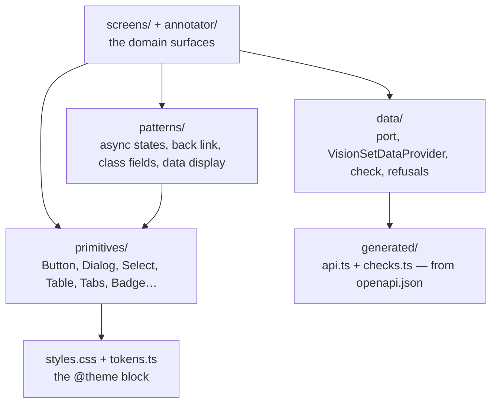
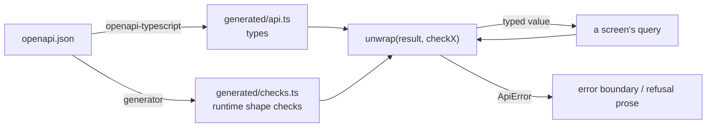

# @visionset/ui-core

[`frontend/ui-core/`](../../../../frontend/ui-core/) is where the product's UI
actually lives: the design system, the domain screens, and the generated contract
they read data against. Everything except routing and the transport itself.

## The layers inside it

## Navigation arrives as a callback

This package imports **no router**. A screen that reached for `useNavigate` would
only work inside a `react-router` tree, which is a dependency the future
enterprise UI has no reason to share. So every destination is a prop -
`onOpenProject`, `onOpenGallery`, `onBack` - and [the app](app.md) turns each into
a URL.

The same rule runs the other way and is worth stating because it decides a lot of
small questions: a host that cannot honour a control **passes no callback and gets
no control**, rather than a dead one.

## Nothing in this package calls `fetch`

`data/port.ts` declares `VisionSetDataClient`, the data contract a host satisfies -
a path, an init object, an answer shaped like `{ok, data}` or `{ok: false, error,
failure}`. There is no base URL in it, no header, no credential. `openapi-fetch`
appears there in **type position only**, describing the request shapes the
generated contract declares; the package never constructs one, and
`tests/scripts/ui_core_boundary.test.mjs` holds that line by scanning the shipped
source for a value import.

`data/VisionSetDataProvider.tsx` is what screens actually sit inside: one query
cache, VisionSet's cache policy, and one answer to a refused credential -
`useApiClient()` is how a screen reads the client the host handed in. The rule used
to be "no module below `ApiProvider` calls `fetch`"; it is now stricter and
machine-checked rather than a review convention: nothing in the shipped package
calls `fetch` at all, because there is nothing in it that could.

A refusal reported through the port comes in two parts, kept deliberately
separate. `ErrorBody.code` is canonical for every domain refusal - VisionSet's own
kernel says `SCHEMA_DRAFT_NOT_FOUND` or `DESTRUCTIVE_SCHEMA_CHANGE` and a screen
branches on that string under any host. `DataFailure` normalizes only two things a
domain code cannot express, because the vocabulary for a *credential* refusal
belongs to whichever host authenticates: `"unauthorized"` and `"unreachable"`.
Nothing else joins that union.

Unauthorized is reported to the host **at most once per credential** - a cache
subscription, not an `onError` on the `QueryClient` a host may supply its own copy
of, and the same identity a cache is keyed to, so a host handing in a new client
mid-render gets a fresh cache and a reset latch together rather than as two
mechanisms that could disagree. A token revoked while an annotator has a job open
produces the failure from whichever background refetch happens to fire next - and
a per-screen check would leave that screen showing an error and every other screen
showing stale data forever.

## The generated contract, and the check beside it

`src/generated/` is written from the committed [`openapi.json`](../../../../openapi.json)
and is never hand-edited. It types a response off the contract and verifies
**nothing** at runtime, so `unwrap` takes a generated *check* as well:

Without the check, a well-formed JSON document of the wrong type reaches a screen
intact and one `undefined` in a formatter takes the page down. The check is
required rather than optional because an optional gate is one every new call site
may forget - and the ones that forgot would be the ones that broke. That the
*right* check is paired with each call is held by
`tests/scripts/checks_wiring.test.mjs`, because a type predicate is assignable
whenever its asserted type is and `tsc` cannot see the mismatch.

## The design system is a shadcn preset

`styles.css` is the shadcn preset `b2iH` (style `nova` on the Radix base, base
colour `neutral`, chart palette `neutral`, icons `lucide`, Geist throughout with
the heading face inheriting the body's, radius `medium`, menu
`inverted`/`subtle`, pointer cursor on pressable controls) - the CLI's own
generated output, transcribed verbatim, plus three VisionSet extension roles
(`stage`, `brand`, `origin-*`) added through shadcn's own
extension convention. `components.json` (`style: "radix-nova"`,
`iconLibrary: "lucide"`, `menuColor: "inverted"`, `menuAccent: "subtle"`) holds
the preset properties shadcn's own tools read - the fields its config schema
defines, and no others. The schema is strict, so the properties it has no field
for - the radius, the fonts, the chart palette, every colour - are values
carried by `styles.css` instead; see [`DESIGN.md`](../../../../DESIGN.md)'s
Source of Truth for the three layers. `tokens.ts` is the TypeScript mirror for a caller that
cannot read CSS. Both themes - light and dark - are declared in full from the
preset, so `bg-primary` in a component here and `bg-primary` in a screen mean
the same colour by construction. There is no `tailwind.config.js` in this
repository and there must not be one - the tokens would acquire a second home.

Four gates hold this: `tokens.test.ts` asserts `styles.css` and `tokens.ts`
agree, declaration for declaration, and that no retired token has returned;
`tests/scripts/design_tokens.test.mjs` scans every tracked frontend file for a
raw colour in a class string, refuses a second `tailwind.config.js`, confines
`brand` to its two identity sites, and holds `components.json` to the
schema-supported field set; `tests/scripts/shadcn_canonical.test.mjs` holds
every primitive to its CLI snapshot; `tests/scripts/docs_links.test.mjs`
keeps [`DESIGN.md`](../../../../DESIGN.md)'s own cross-references honest.

## Libraries

The primitive and utility stack is an architecture decision recorded here, not a
visual-design rule. The current choices:

| Concern | Choice |
| --- | --- |
| UI primitives | Radix (+ shadcn-style composition with `cva` and `cn`) - the open-code shadcn maintenance model is the direction: a primitive is VisionSet-owned source in `frontend/ui-core/src/primitives/`, edited directly, not a package dependency upgraded blindly — each file there is the shadcn CLI's own output (snapshot in `shadcn/`), edited only by adding lines. The dependency is the `radix-ui` umbrella package, not the scoped `@radix-ui/react-*` packages it replaces |
| Icons | `lucide-react`, and nothing else: the primitives, the screens and the annotation workspace all draw from it, and no package declares a second icon library |
| Styling | Tailwind v4, CSS-first `@theme`, on the shadcn preset `b2iH` - no `tailwind.config.js`, ever |
| Toasts | sonner, themed by a framework adapter in `sonner.tsx` (marked `SHADCN FRAMEWORK ADAPTER`) that reads VisionSet's one theme source — `.dark` on `<html>` — instead of shadcn's canonical `next-themes` hook, which has no provider to read here |
| Component tests | vitest + jsdom + @testing-library/react |
| Server state | TanStack Query v5 |

Do not add a library for a covered concern without a documented reason.

## Related

[`DESIGN.md`](../../../../DESIGN.md) is the contract this package implements.
[`docs/content/ui.md`](../../ui.md) covers the data shell. The
`ui-capabilities` skill governs any state-gated control, and
[`docs/content/ui/navigation.md`](../../ui/navigation.md) is the canonical sitemap.
