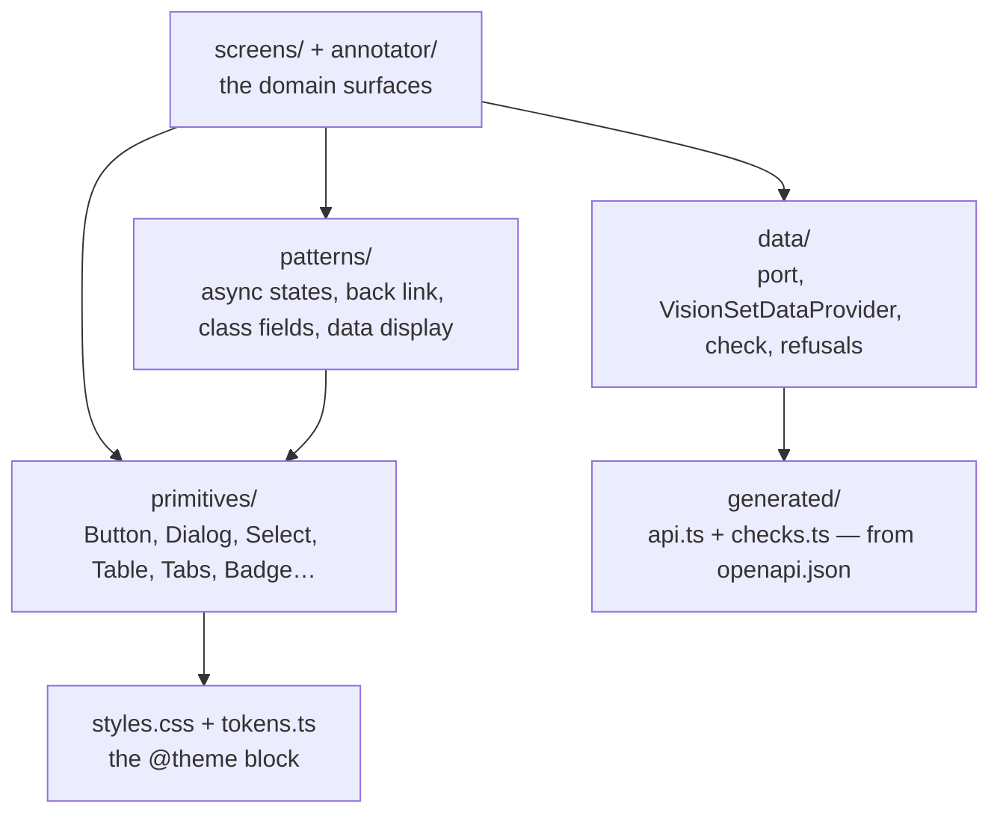
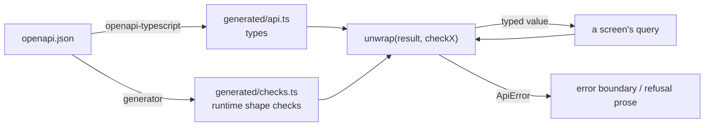

# @visionset/ui-core

[`frontend/ui-core/`](../../../../frontend/ui-core/) is where the product's UI
actually lives: the design system, the domain screens, and the generated contract
they read data against. Everything except routing and the transport itself.

## The layers inside it

## Navigation arrives as a callback

This package imports **no router**. A screen that reached for `useNavigate` would
only work inside a `react-router` tree, which is a dependency the future
enterprise UI has no reason to share. So every destination is a prop -
`onOpenProject`, `onOpenGallery`, `onBack` - and [the app](app.md) turns each into
a URL.

The same rule runs the other way and is worth stating because it decides a lot of
small questions: a host that cannot honour a control **passes no callback and gets
no control**, rather than a dead one.

## A second host-injected runtime, for browser video import

`data/port.ts` is not the only seam a host satisfies. `media/port.ts` declares
`VisionSetMediaRuntime` - a `VideoMaterializer` that decodes a file into frames and a
`createFrameSink` that says where those frames go - and `VisionSetMediaProvider` /
`useMediaRuntime()` carry it the same way `VisionSetDataProvider` / `useApiClient()`
carry the data client. The package depends on `@visionset/media`'s **root
entrypoint only**: it knows the shape of a materializer and a sink, never which
concrete materializer decodes a file or which transport a `FrameSink` writes to. It
never imports `@visionset/media/mediabunny`, the Mediabunny-backed browser adapter -
that choice, like the transport behind `VisionSetDataClient`, belongs to whichever
package composes the application (see [app.md](app.md)).

Unlike the data client, this runtime is optional, and the reason is the same rule
already stated above: **a host that cannot honour a control passes no callback and
gets no control.** Browser video import is a capability some hosts will not offer at
all - a build running somewhere `VideoDecoder` does not exist, or a host with its own
upload path entirely - so `useMediaRuntime()` answers absence as a plain, renderable
`null` rather than throwing. That is deliberately different from `useApiClient()`,
which throws on a missing client because every screen in this package assumes a data
client exists; no screen here has an equivalent unconditional assumption about video
import, so there is exactly one hook, nullable, and no second
`useOptionalMediaRuntime` beside it.

`tests/scripts/ui_core_boundary.test.mjs` holds the never-import half of this the same
way it holds the `fetch` boundary below: it now also refuses a `@visionset/media/mediabunny`
import, value or type, anywhere in this package's shipped source.

## A third host-injected runtime, for suggesting on this device

`inference/browserPort.ts` declares `VisionSetBrowserInferenceRuntime` - which targets can
answer an interactive suggestion **on this device, right now**, and how to ask one of them -
and `VisionSetBrowserInferenceProvider` / `useBrowserInferenceRuntime()` carry it exactly as
`media/port.ts` is carried. Third seam, same rule: this package owns the port and the React
plumbing and never the implementation. It imports no model runtime, no execution backend and no
concrete adapter, and it discovers none either.

Absence is the ordinary case, so the hook answers `null` and never throws - the rule stated
twice above, for a third capability. **A host that offers browser inference composes the
runtime at the host boundary; a host that does not offer it supplies nothing.** No host in this
repository supplies one, so every build behaves as it did before the port existed.

The port is two members wide on purpose, and it is an *execution* contract rather than a
catalog: finding and obtaining a model is a question about things that cannot answer yet, and
this is not where it is answered. Nor is the narrowness a promise that growth is free - the
interface is published, so adding a **required** member to it would break every host
implementing the older one, and
[browser inference is host-injected](../decisions/browser-inference-is-host-injected.md) says
how it is grown instead.

> An `InferenceConnection` is a model the VisionSet server has. A browser inference runtime is
> something this browser can do. They are not two spellings of one idea, and neither is
> derivable from the other.

## The displayed asset is the browser pixel source

`AssetImage` fetches an asset once through the credentialed data client, retains that exact Blob
only while the asset is mounted, and owns the object URL it gives the existing annotator image.
The URL is revoked and an unfinished request is aborted when the asset is replaced or unmounted.
There is no JavaScript Blob cache: revisiting an asset relies on the server's immutable HTTP cache.

The React annotator adapter can report a generation-scoped lease over the same visible decoded
`` — `AnnotatorCanvas`'s `onImageReady`, fired from that image's own `onLoad`. A future host
that needs pixels reads them lazily from that lease: nothing draws to a canvas or calls
`getImageData` until a caller asks for `readRgb(width, height)`, in the asset descriptor's
coordinate frame, and ordinary mounting and display never asks. It does not fetch or decode a
second copy of the asset, and it does not construct a second `Image` to read from — the element
handed back is the exact node the person is looking at. A lease refuses after its image source is
replaced *or* after its owning `AnnotatorCanvas` instance unmounts, which prevents a retained
reference for one asset from reading pixels of the next asset either through a reused DOM node or
through the detached one a host's real asset-switch (unmount the old canvas, mount a fresh one)
leaves behind.

This is resource plumbing only. It neither selects a browser model nor exposes an inference
target — no capability in this phase lets a host ask for local inference at all; composing pixels
with a browser runtime remains a later host decision.

**What is proved, and what is not claimed.** `e2e/assetPixels.spec.ts` drives a real Chromium
against a tiny runtime-generated image and confirms, in that browser, on that image: one content
request, the same decoded `` handed back as the pixel source, and the exact descriptor-frame
RGB a real 2D context produced. That is evidence about this seam's wiring, not a claim that a
browser's canvas decode agrees with the server's own (Pillow) decode byte-for-byte in general —
this phase changes no server decoding, and takes no position on cross-decoder parity beyond what
is measured here.

**Measured browser-canvas-vs-Pillow divergence.** A separate, informal comparison against the
server's `convert("RGB")` decode found three real categories of disagreement: alpha-premultiplication
rounding loss on partially-transparent pixels, EXIF-orientation auto-rotation (a browser applies an
image's EXIF orientation when decoding to canvas; the server's direct-bytes decode path does not),
and AdobeRGB ICC-profile color management (a browser color-manages a tagged profile toward sRGB on
decode; the server's path does not). None of these are exact figures worth repeating here — they
are a known limitation, not a benchmark — and no consumer of this lease has yet needed to reconcile
them, since nothing in this phase reads pixels for inference. A future phase that feeds this lease's
`readRgb` output to a model must account for these divergences before treating browser-decoded
pixels as equivalent to the server's own decode of the same asset.

## Asking for a suggestion is not sending one

`inference/suggestionExecutor.ts` is the seam the runtime above would plug into, and it exists
on its own. A `SuggestionRequest` is what the editor asks - whose asset, the accumulated
positive and negative points in placement order, the geometry kinds the ask will accept, and
where the adjustments stand - and a `SuggestionExecutor` answers one. The request carries **no
connection id**: where an answer is routed is the executor's own business, fixed when it is
built.

`useServerSuggestionExecutor()` is the only implementation that ships. It posts
`/inference/suggest` exactly as `AnnotationPage` used to, and answers `null` when there is no
usable connection - "nowhere to send this" is the state `usableConnection()` already reports
through its blocker, and the panel renders the blocker rather than a refusal.

Every executor answers in one shape, `SuggestionOut`, which is what keeps the suggestion
session - the accumulated points, the serial, and the rule that a slow first answer may not
overwrite a fast second one - written once. The editor consumes that promise with a
two-argument `then(success, failure)` rather than a chained `.catch`, so that only the
executor's own rejection is read as a refusal and a failure while *reading* a successful answer
is never dressed up as the model declining to answer.

The constraints behind all of this are recorded under
[Decisions](../decisions/README.md): [a connection is not a
browser](../decisions/a-connection-is-not-a-browser.md), [browser inference is
host-injected](../decisions/browser-inference-is-host-injected.md), [asking is not
sending](../decisions/asking-is-not-sending.md), and [where a model runs is not where it came
from](../decisions/where-a-model-runs-is-not-where-it-came-from.md).

## Nothing in this package calls `fetch`

`data/port.ts` declares `VisionSetDataClient`, the data contract a host satisfies -
a path, an init object, an answer shaped like `{ok, data}` or `{ok: false, error,
failure}`. There is no base URL in it, no header, no credential. `openapi-fetch`
appears there in **type position only**, describing the request shapes the
generated contract declares; the package never constructs one, and
`tests/scripts/ui_core_boundary.test.mjs` holds that line by scanning the shipped
source for a value import.

`data/VisionSetDataProvider.tsx` is what screens actually sit inside: one query
cache, VisionSet's cache policy, and one answer to a refused credential -
`useApiClient()` is how a screen reads the client the host handed in. The rule used
to be "no module below `ApiProvider` calls `fetch`"; it is now stricter and
machine-checked rather than a review convention: nothing in the shipped package
calls `fetch` at all, because there is nothing in it that could.

A refusal reported through the port comes in two parts, kept deliberately
separate. `ErrorBody.code` is canonical for every domain refusal - VisionSet's own
kernel says `SCHEMA_DRAFT_NOT_FOUND` or `DESTRUCTIVE_SCHEMA_CHANGE` and a screen
branches on that string under any host. `DataFailure` normalizes only two things a
domain code cannot express, because the vocabulary for a *credential* refusal
belongs to whichever host authenticates: `"unauthorized"` and `"unreachable"`.
Nothing else joins that union.

Unauthorized is reported to the host **at most once per active authorization/data scope
activation**. Returning to a scope after another one was active starts a new window; late
responses from its prior activation remain ignored.
The host supplies that opaque scope explicitly; it keys the cache, descendant
remount, and refusal latch together, so a stable adapter can safely cross a
principal, tenant, workspace, or credential transition without exposing prior
data. The provider observes normalized refusal results from every port call,
including direct binary and imperative requests, while cache subscriptions remain
a backstop for errors raised directly by TanStack work. A token revoked while an
annotator has a job open therefore triggers one host response rather than every
view racing to erase the token.

## The generated contract, and the check beside it

`src/generated/` is written from the committed [`openapi.json`](../../../../openapi.json)
and is never hand-edited. It types a response off the contract and verifies
**nothing** at runtime, so `unwrap` takes a generated *check* as well:

Without the check, a well-formed JSON document of the wrong type reaches a screen
intact and one `undefined` in a formatter takes the page down. The check is
required rather than optional because an optional gate is one every new call site
may forget - and the ones that forgot would be the ones that broke. That the
*right* check is paired with each call is held by
`tests/scripts/checks_wiring.test.mjs`, because a type predicate is assignable
whenever its asserted type is and `tsc` cannot see the mismatch.

## The design system is a shadcn preset

`styles.css` is the shadcn preset `b2iH` (style `nova` on the Radix base, base
colour `neutral`, chart palette `neutral`, icons `lucide`, Geist throughout with
the heading face inheriting the body's, radius `medium`, menu
`inverted`/`subtle`, pointer cursor on pressable controls) - the CLI's own
generated output, transcribed verbatim, plus three VisionSet extension roles
(`stage`, `brand`, `origin-*`) added through shadcn's own
extension convention. `components.json` (`style: "radix-nova"`,
`iconLibrary: "lucide"`, `menuColor: "inverted"`, `menuAccent: "subtle"`) holds
the preset properties shadcn's own tools read - the fields its config schema
defines, and no others. The schema is strict, so the properties it has no field
for - the radius, the fonts, the chart palette, every colour - are values
carried by `styles.css` instead; see [`DESIGN.md`](../../../../DESIGN.md)'s
Source of Truth for the three layers. `tokens.ts` is the TypeScript mirror for a caller that
cannot read CSS. Both themes - light and dark - are declared in full from the
preset, so `bg-primary` in a component here and `bg-primary` in a screen mean
the same colour by construction. There is no `tailwind.config.js` in this
repository and there must not be one - the tokens would acquire a second home.

Four gates hold this: `tokens.test.ts` asserts `styles.css` and `tokens.ts`
agree, declaration for declaration, and that no retired token has returned;
`tests/scripts/design_tokens.test.mjs` scans every tracked frontend file for a
raw colour in a class string, refuses a second `tailwind.config.js`, confines
`brand` to its two identity sites, and holds `components.json` to the
schema-supported field set; `tests/scripts/shadcn_canonical.test.mjs` holds
every primitive to its CLI snapshot; `tests/scripts/docs_links.test.mjs`
keeps [`DESIGN.md`](../../../../DESIGN.md)'s own cross-references honest.

## Libraries

The primitive and utility stack is an architecture decision recorded here, not a
visual-design rule. The current choices:

| Concern | Choice |
| --- | --- |
| UI primitives | Radix (+ shadcn-style composition with `cva` and `cn`) - the open-code shadcn maintenance model is the direction: a primitive is VisionSet-owned source in `frontend/ui-core/src/primitives/`, edited directly, not a package dependency upgraded blindly — each file there is the shadcn CLI's own output (snapshot in `shadcn/`), edited only by adding lines. The dependency is the `radix-ui` umbrella package, not the scoped `@radix-ui/react-*` packages it replaces |
| Icons | `lucide-react`, and nothing else: the primitives, the screens and the annotation workspace all draw from it, and no package declares a second icon library |
| Styling | Tailwind v4, CSS-first `@theme`, on the shadcn preset `b2iH` - no `tailwind.config.js`, ever |
| Toasts | sonner, themed by a framework adapter in `sonner.tsx` (marked `SHADCN FRAMEWORK ADAPTER`) that reads VisionSet's one theme source — `.dark` on `<html>` — instead of shadcn's canonical `next-themes` hook, which has no provider to read here |
| Component tests | vitest + jsdom + @testing-library/react |
| Server state | TanStack Query v5 |

Do not add a library for a covered concern without a documented reason.

## Related

[`DESIGN.md`](../../../../DESIGN.md) is the contract this package implements.
[`docs/content/ui.md`](../../ui.md) covers the data shell. The
`ui-capabilities` skill governs any state-gated control, and
[`docs/content/ui/navigation.md`](../../ui/navigation.md) is the canonical sitemap.
